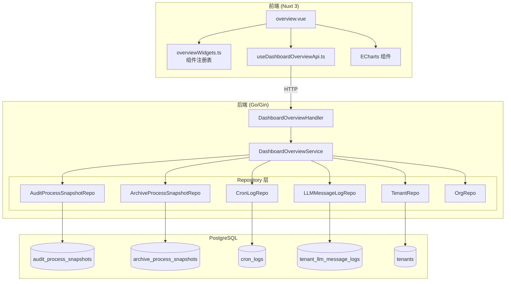
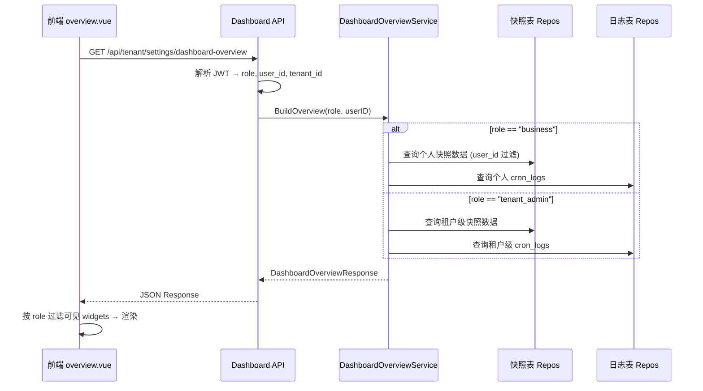

# 设计文档：仪表盘角色差异化优化

## 概述

本设计对 OA 智审平台仪表盘模块进行全面重构，核心变更包括：

1. **数据源切换**：将统计数据源从日志表（audit_logs / archive_logs）迁移到快照表（audit_process_snapshots / archive_process_snapshots），确保仅统计有效数据
2. **角色差异化**：为 business / tenant_admin / system_admin 三种角色提供完全不同的组件集合与数据范围
3. **组件增强**：引入本周概览、堆叠柱状图趋势、详细动态标注、分类待办等新功能
4. **图表可视化**：集成 ECharts 图表库，替代现有的纯 CSS 柱状图
5. **API 重构**：调整后端 DTO 和 Service 层以支持新的数据结构

### 影响范围

| 层级 | 涉及文件 | 变更类型 |
|------|---------|---------|
| 后端 DTO | `dashboard_overview_dto.go` | 重构响应结构 |
| 后端 Service | `dashboard_overview_service.go` | 重写数据聚合逻辑 |
| 后端 Repository | `audit_process_snapshot_repo.go`, `archive_process_snapshot_repo.go`, `llm_message_log_repo.go`, `cron_log_repo.go` | 新增仪表盘查询方法 |
| 前端组件 | `pages/overview.vue` | 重构组件渲染逻辑 |
| 前端常量 | `constants/overviewWidgets.ts` | 调整组件注册表 |
| 前端类型 | `types/dashboard-overview.ts` | 更新类型定义 |
| 前端 API | `composables/useDashboardOverviewApi.ts` | 保持不变 |
| 前端 i18n | `locales/zh-CN.ts`, `locales/en-US.ts` | 新增翻译键 |
| 数据库 | 新增迁移文件 | `tenant_llm_message_logs` 增加 `call_type` 列 |

---

## 架构

### 系统架构图



### 数据流



---

## 组件与接口

### 角色-组件映射表

| 组件 ID | 组件名称 | business | tenant_admin | system_admin |
|---------|---------|:--------:|:------------:|:------------:|
| `weekly_overview` | 本周概览 | ✅ | ✅ | ❌ |
| `pending_tasks` | 待办任务 | ✅ | ❌ | ❌ |
| `weekly_trend` | 审核趋势 | ✅ | ✅ | ❌ |
| `cron_tasks` | 定时任务 | ✅ | ❌ | ❌ |
| `recent_activity` | 最近动态 | ✅ | ✅ | ❌ |
| `dept_distribution` | 部门分布 | ❌ | ✅ | ❌ |
| `user_activity` | 用户活跃排名 | ❌ | ✅ | ❌ |
| `platform_tenant_stats` | 租户规模 | ❌ | ❌ | ✅ |
| `ai_performance` | AI 模型表现 | ❌ | ❌ | ✅ |
| `tenant_usage` | 租户资源用量 | ❌ | ❌ | ✅ |
| `platform_tenant_ranking` | 租户审核排名 | ❌ | ❌ | ✅ |

**变更说明：**
- 新增 `weekly_overview` 替代原 `audit_summary`
- business 移除 `archive_review`、`dept_distribution`、`user_activity`、`ai_performance`、`tenant_usage`
- tenant_admin 移除 `pending_tasks`、`cron_tasks`、`archive_review`、`ai_performance`、`tenant_usage`
- system_admin 移除 `audit_summary`、`weekly_trend`、`archive_review`、`recent_activity`、`pending_tasks`、`cron_tasks`
- business 的组件可见性额外受 `page_permissions` 控制


### 前端组件结构

#### 1. overviewWidgets.ts — 组件注册表重构

```typescript
// 新增 widget ID
export type OverviewWidgetId =
  | 'weekly_overview'      // 新增：替代 audit_summary
  | 'pending_tasks'
  | 'weekly_trend'
  | 'cron_tasks'
  | 'recent_activity'
  | 'dept_distribution'
  | 'user_activity'
  | 'ai_performance'
  | 'tenant_usage'
  | 'platform_tenant_stats'
  | 'platform_tenant_ranking'

// 新增：组件与页面权限的映射关系（business 角色专用）
export const WIDGET_PAGE_PERMISSION_MAP: Partial<Record<OverviewWidgetId, string>> = {
  weekly_overview: '',           // 始终可见
  pending_tasks: '',             // 始终可见
  weekly_trend: '',              // 始终可见
  cron_tasks: '/cron',           // 需要定时任务页面权限
  recent_activity: '',           // 始终可见
}
```

#### 2. overview.vue — 页面权限过滤逻辑

```typescript
// business 角色：根据 page_permissions 过滤可见组件
const availableWidgets = computed(() => {
  const role = effectiveActiveRoleForApi.value
  if (!role) return []
  
  let widgets = OVERVIEW_WIDGETS.filter(w => 
    w.requiredPermissions.includes(role as PermissionGroup)
  )
  
  // business 角色额外按 page_permissions 过滤
  if (role === 'business') {
    const perms = new Set(currentUser.value?.page_permissions ?? [])
    widgets = widgets.filter(w => {
      const requiredPerm = WIDGET_PAGE_PERMISSION_MAP[w.id]
      return !requiredPerm || perms.has(requiredPerm)
    })
  }
  
  return widgets
})
```

#### 3. ECharts 集成方案

安装依赖：
```bash
cd frontend && npm install echarts vue-echarts
```

创建 `components/charts/StackedBarChart.vue` 封装堆叠柱状图组件，接收标准化的数据 props。

### 后端接口设计

#### GET /api/tenant/settings/dashboard-overview

**请求方**：business / tenant_admin（通过 JWT 中的 `active_role` 区分）

**响应结构变更**（`DashboardOverviewResponse`）：

```go
type DashboardOverviewResponse struct {
    // 本周概览（替代原 AuditSummary）
    WeeklyOverview *WeeklyOverviewData `json:"weekly_overview"`
    
    // 待办任务（仅 business）
    PendingTasks *PendingTasksData `json:"pending_tasks,omitempty"`
    
    // 审核趋势 — 按日按功能分组（堆叠柱状图数据）
    WeeklyTrend []WeeklyTrendDayData `json:"weekly_trend"`
    
    // 最近动态（带详细标注）
    RecentActivity []ActivityItemEnriched `json:"recent_activity"`
    
    // 定时任务列表（仅 business）
    CronTasks []CronTaskPreview `json:"cron_tasks,omitempty"`
    
    // 部门分布（仅 tenant_admin）
    DeptDistribution []DeptDistributionData `json:"dept_distribution,omitempty"`
    
    // 用户活跃排名（仅 tenant_admin）
    UserActivity []UserActivityRow `json:"user_activity,omitempty"`
}
```

#### GET /api/admin/dashboard-overview

**请求方**：system_admin

**响应结构变更**（`PlatformDashboardOverviewResponse`）：

```go
type PlatformDashboardOverviewResponse struct {
    // 租户规模（含人员数量）
    TenantStats *PlatformTenantStatsData `json:"tenant_stats"`
    
    // AI 模型表现（按模型+调用类型分组）
    AIPerformance *PlatformAIPerformanceData `json:"ai_performance"`
    
    // 租户资源用量（按租户分列）
    TenantUsageList []TenantUsageRow `json:"tenant_usage_list"`
    
    // 租户审核排名（含失败记录）
    TenantRanking []PlatformTenantRankRowEnriched `json:"tenant_ranking"`
}
```

---

## 数据模型

### 新增/变更 DTO 定义

#### 本周概览数据（需求 3）

```go
// WeeklyOverviewData 本周概览（周一 00:00 至当前）
type WeeklyOverviewData struct {
    Total         int64 `json:"total"`          // 三项之和
    AuditCount    int64 `json:"audit_count"`    // 审核工作台快照本周条数
    ArchiveCount  int64 `json:"archive_count"`  // 归档复盘快照本周条数
    CronCount     int64 `json:"cron_count"`     // 定时任务本周执行次数
}
```

#### 待办任务数据（需求 7）

```go
// PendingTasksData 待办任务（区分类型）
type PendingTasksData struct {
    AuditPending   int64 `json:"audit_pending"`   // 审核工作台待办
    ArchivePending int64 `json:"archive_pending"`  // 归档复盘待办
    Total          int64 `json:"total"`
}
```

#### 审核趋势数据（需求 4）

```go
// WeeklyTrendDayData 每天按功能分组的数据（堆叠柱状图）
type WeeklyTrendDayData struct {
    Date         string `json:"date"`          // MM-DD
    AuditCount   int64  `json:"audit_count"`   // 审核工作台
    CronCount    int64  `json:"cron_count"`    // 定时任务
    ArchiveCount int64  `json:"archive_count"` // 归档复盘
}
```

#### 最近动态增强（需求 6）

```go
// ActivityItemEnriched 带详细标注的动态条目
type ActivityItemEnriched struct {
    ID        string `json:"id"`
    Kind      string `json:"kind"`       // audit | archive | cron
    Title     string `json:"title"`
    UserName  string `json:"user_name"`
    CreatedAt string `json:"created_at"` // RFC3339
    
    // 审核工作台标注
    Recommendation string `json:"recommendation,omitempty"` // approve/return/review
    Score          int    `json:"score,omitempty"`
    
    // 归档复盘标注
    Compliance      string `json:"compliance,omitempty"`
    ComplianceScore int    `json:"compliance_score,omitempty"`
    
    // 定时任务标注
    CronStatus string `json:"cron_status,omitempty"`  // success/failed/running
    TaskLabel  string `json:"task_label,omitempty"`
}
```

#### 部门分布增强（需求 9）

```go
// DeptDistributionData 部门分布（区分三个功能）
type DeptDistributionData struct {
    Department   string `json:"department"`
    AuditCount   int64  `json:"audit_count"`
    CronCount    int64  `json:"cron_count"`
    ArchiveCount int64  `json:"archive_count"`
    Total        int64  `json:"total"`
}
```

#### 系统管理员 — 租户规模增强（需求 14）

```go
// PlatformTenantStatsData 租户规模（含人员数量）
type PlatformTenantStatsData struct {
    TenantTotal  int64                  `json:"tenant_total"`
    TenantActive int64                  `json:"tenant_active"`
    ActiveCriteria string               `json:"active_criteria"` // 活跃判断标准说明
    Tenants      []TenantStatsRow       `json:"tenants"`
}

type TenantStatsRow struct {
    TenantID   string `json:"tenant_id"`
    TenantName string `json:"tenant_name"`
    TenantCode string `json:"tenant_code"`
    UserCount  int64  `json:"user_count"`  // 注册人员数量
    IsActive   bool   `json:"is_active"`
}
```

#### 系统管理员 — AI 模型表现增强（需求 12）

```go
// PlatformAIPerformanceData AI 模型表现（按模型+调用类型分组）
type PlatformAIPerformanceData struct {
    Models []AIModelPerformanceRow `json:"models"`
}

type AIModelPerformanceRow struct {
    ModelConfigID string `json:"model_config_id"`
    ModelName     string `json:"model_name"`
    DisplayName   string `json:"display_name"`
    Provider      string `json:"provider"`
    
    // 按调用类型分组
    ReasoningStats AICallTypeStats `json:"reasoning_stats"`
    StructuredStats AICallTypeStats `json:"structured_stats"`
    
    // 总体
    OverallSuccessRate float64 `json:"overall_success_rate"`
    TotalCalls         int64   `json:"total_calls"`
}

type AICallTypeStats struct {
    Calls       int64   `json:"calls"`
    SuccessRate float64 `json:"success_rate"`
    AvgMs       int64   `json:"avg_ms"`
}
```

#### 系统管理员 — 租户资源用量（需求 13）

```go
// TenantUsageRow 按租户分列的资源用量
type TenantUsageRow struct {
    TenantID   string `json:"tenant_id"`
    TenantName string `json:"tenant_name"`
    TenantCode string `json:"tenant_code"`
    TokenUsed  int64  `json:"token_used"`
    TokenQuota int64  `json:"token_quota"`
}
```

#### 系统管理员 — 租户审核排名增强（需求 15）

```go
// PlatformTenantRankRowEnriched 租户审核排名（含失败记录）
type PlatformTenantRankRowEnriched struct {
    TenantID       string `json:"tenant_id"`
    TenantName     string `json:"tenant_name"`
    TenantCode     string `json:"tenant_code"`
    AuditCount     int64  `json:"audit_count"`     // 审核快照数
    ArchiveCount   int64  `json:"archive_count"`   // 归档复盘快照数
    CronCount      int64  `json:"cron_count"`      // 定时任务执行数
    AuditFailed    int64  `json:"audit_failed"`    // 审核失败数
    ArchiveFailed  int64  `json:"archive_failed"`  // 归档复盘失败数
}
```


### 数据库变更

#### 1. tenant_llm_message_logs 新增 call_type 列

需求 12 要求区分推理调用（reasoning）和结构化调用（structured）。当前 `tenant_llm_message_logs` 表仅有 `request_type`（audit/archive/other），缺少调用类型字段。

**迁移 SQL：**

```sql
-- 000029_llm_call_type.up.sql
ALTER TABLE tenant_llm_message_logs
  ADD COLUMN call_type VARCHAR(20) NOT NULL DEFAULT 'reasoning';

COMMENT ON COLUMN tenant_llm_message_logs.call_type 
  IS 'LLM 调用类型：reasoning=推理调用 / structured=结构化调用';

CREATE INDEX idx_tllm_call_type 
  ON tenant_llm_message_logs(tenant_id, call_type);
```

**Go Model 变更：**

```go
// TenantLLMMessageLog 新增字段
CallType string `gorm:"size:20;not null;default:reasoning" json:"call_type"` // reasoning | structured
```

> 注意：现有记录默认为 `reasoning`。Python AI 服务在写入 LLM 日志时需同步传入 `call_type` 字段。

#### 2. 无需新建快照表

- `audit_process_snapshots` 和 `archive_process_snapshots` 已存在，结构满足需求
- `cron_logs` 继续直接查询，无需快照表（需求 1.4）

---

## 低层设计：后端实现细节

### Repository 层新增方法

#### AuditProcessSnapshotRepo 新增

```go
// CountThisWeek 本周（周一 00:00 UTC 至今）快照条数
// userID 非 nil 时按关联的 latest_valid_log_id → audit_logs.user_id 过滤
func (r *AuditProcessSnapshotRepo) CountThisWeek(c *gin.Context, userID *uuid.UUID) (int64, error)

// WeeklyTrendByDay 本周每天的快照条数（用于堆叠柱状图的审核工作台部分）
func (r *AuditProcessSnapshotRepo) WeeklyTrendByDay(c *gin.Context, userID *uuid.UUID) ([]DayCount, error)

// RecentEnriched 最近 N 条快照（带 recommendation + score）
func (r *AuditProcessSnapshotRepo) RecentEnriched(c *gin.Context, limit int, userID *uuid.UUID) ([]AuditSnapshotEnrichedRow, error)

// CountByDepartment 按部门统计快照数（tenant_admin 用）
func (r *AuditProcessSnapshotRepo) CountByDepartment(c *gin.Context) ([]DeptCount, error)

// CountByUserRanking 按用户统计有效快照数排名
func (r *AuditProcessSnapshotRepo) CountByUserRanking(c *gin.Context, limit int) ([]UserRankRow, error)

// CountByTenantGlobal 全平台按租户统计快照数
func (r *AuditProcessSnapshotRepo) CountByTenantGlobal() ([]TenantSnapshotCount, error)
```

**关键 SQL — CountThisWeek：**

```sql
SELECT COUNT(*) 
FROM audit_process_snapshots aps
LEFT JOIN audit_logs al ON al.id = aps.latest_valid_log_id
WHERE aps.tenant_id = $1
  AND aps.updated_at >= date_trunc('week', CURRENT_TIMESTAMP AT TIME ZONE 'UTC')
  -- 如果 userID 非空：
  AND al.user_id = $2
```

**关键 SQL — WeeklyTrendByDay：**

```sql
WITH days AS (
  SELECT generate_series(
    date_trunc('week', CURRENT_DATE AT TIME ZONE 'UTC')::date,
    (CURRENT_DATE AT TIME ZONE 'UTC')::date,
    INTERVAL '1 day'
  )::date AS d
)
SELECT TO_CHAR(days.d, 'MM-DD') AS date,
       COALESCE(b.cnt, 0)::bigint AS count
FROM days
LEFT JOIN (
  SELECT DATE(aps.updated_at AT TIME ZONE 'UTC') AS d,
         COUNT(*)::bigint AS cnt
  FROM audit_process_snapshots aps
  LEFT JOIN audit_logs al ON al.id = aps.latest_valid_log_id
  WHERE aps.tenant_id = $1
    AND aps.updated_at >= date_trunc('week', CURRENT_TIMESTAMP AT TIME ZONE 'UTC')
    -- 可选 user_id 过滤
  GROUP BY 1
) b ON b.d = days.d
ORDER BY days.d
```

#### ArchiveProcessSnapshotRepo 新增

```go
// CountThisWeek 本周归档复盘快照条数
func (r *ArchiveProcessSnapshotRepo) CountThisWeek(c *gin.Context, userID *uuid.UUID) (int64, error)

// WeeklyTrendByDay 本周每天的归档复盘快照条数
func (r *ArchiveProcessSnapshotRepo) WeeklyTrendByDay(c *gin.Context, userID *uuid.UUID) ([]DayCount, error)

// RecentEnriched 最近 N 条快照（带 compliance + compliance_score）
func (r *ArchiveProcessSnapshotRepo) RecentEnriched(c *gin.Context, limit int, userID *uuid.UUID) ([]ArchiveSnapshotEnrichedRow, error)

// CountByDepartment 按部门统计归档快照数
func (r *ArchiveProcessSnapshotRepo) CountByDepartment(c *gin.Context) ([]DeptCount, error)

// CountByTenantGlobal 全平台按租户统计归档快照数
func (r *ArchiveProcessSnapshotRepo) CountByTenantGlobal() ([]TenantSnapshotCount, error)

// CountFailedByTenantGlobal 全平台按租户统计归档失败数（从 archive_logs 查 status=failed）
func (r *ArchiveProcessSnapshotRepo) CountFailedByTenantGlobal() ([]TenantFailedCount, error)
```

#### CronLogRepo 新增

```go
// CountThisWeek 本周定时任务执行次数
func (r *CronLogRepo) CountThisWeek(c *gin.Context, userID *uuid.UUID) (int64, error)

// WeeklyTrendByDay 本周每天的定时任务执行次数
func (r *CronLogRepo) WeeklyTrendByDay(c *gin.Context, userID *uuid.UUID) ([]DayCount, error)

// RecentEnriched 最近 N 条定时任务日志（带 status + task_label）
func (r *CronLogRepo) RecentEnriched(tenantID uuid.UUID, limit int, userID *uuid.UUID) ([]CronLogEnrichedRow, error)

// CountByDepartment 按部门统计定时任务执行数（通过 task_owner_user_id → org_members → departments）
func (r *CronLogRepo) CountByDepartment(c *gin.Context) ([]DeptCount, error)

// CountByTenantGlobal 全平台按租户统计定时任务执行数
func (r *CronLogRepo) CountByTenantGlobal() ([]TenantCronCount, error)
```

**CronLog 用户过滤逻辑：**
- business 角色：通过 `task_owner_user_id = userID` 或 `created_by = username` 过滤
- tenant_admin 角色：`userID = nil`，查询整个租户

#### LLMMessageLogRepo 新增

```go
// DashboardAIPerformanceByModel 按模型+调用类型分组的 AI 性能统计（system_admin 用）
func (r *LLMMessageLogRepo) DashboardAIPerformanceByModel() ([]AIModelCallStats, error)
```

**关键 SQL：**

```sql
SELECT 
    tl.model_config_id,
    amc.model_name,
    amc.display_name,
    amc.provider,
    tl.call_type,
    COUNT(*)::bigint AS calls,
    COALESCE(AVG(tl.duration_ms), 0)::bigint AS avg_ms
FROM tenant_llm_message_logs tl
LEFT JOIN ai_model_configs amc ON amc.id = tl.model_config_id
WHERE tl.model_config_id IS NOT NULL
GROUP BY tl.model_config_id, amc.model_name, amc.display_name, amc.provider, tl.call_type
ORDER BY calls DESC
```

> 成功率计算：需要关联 audit_logs / archive_logs 的 status 字段。对于每个 model_config_id，成功率 = 关联的 completed 日志数 / (completed + failed) 日志数。

#### TenantRepo 新增

```go
// DashboardTenantListWithUserCount 所有租户列表（含注册人员数量）
func (r *TenantRepo) DashboardTenantListWithUserCount() ([]TenantWithUserCount, error)

// DashboardActiveTenantIDs 近 30 天有快照记录的租户 ID 集合
func (r *TenantRepo) DashboardActiveTenantIDs() (map[string]bool, error)
```

**活跃租户判断 SQL：**

```sql
SELECT DISTINCT tenant_id::text FROM (
    SELECT tenant_id FROM audit_process_snapshots 
    WHERE updated_at >= NOW() - INTERVAL '30 days'
    UNION
    SELECT tenant_id FROM archive_process_snapshots 
    WHERE updated_at >= NOW() - INTERVAL '30 days'
) sub
```


### Service 层重构

#### BuildOverview 方法重写

```go
func (s *DashboardOverviewService) BuildOverview(
    c *gin.Context, 
    activeRole string, 
    viewerUserID uuid.UUID, 
    viewerUsername string,
) (*dto.DashboardOverviewResponse, error) {
    
    // 1. 确定数据范围
    var userScope *uuid.UUID
    if activeRole == "business" {
        u := viewerUserID
        userScope = &u
    }
    
    out := &dto.DashboardOverviewResponse{}
    
    // 2. 本周概览（所有角色共享，数据范围不同）
    auditWeek, _ := s.auditSnapshotRepo.CountThisWeek(c, userScope)
    archiveWeek, _ := s.archiveSnapshotRepo.CountThisWeek(c, userScope)
    cronWeek, _ := s.cronLogRepo.CountThisWeek(c, userScope)
    out.WeeklyOverview = &dto.WeeklyOverviewData{
        AuditCount:   auditWeek,
        ArchiveCount: archiveWeek,
        CronCount:    cronWeek,
        Total:        auditWeek + archiveWeek + cronWeek,
    }
    
    // 3. 审核趋势（堆叠柱状图数据）
    auditTrend, _ := s.auditSnapshotRepo.WeeklyTrendByDay(c, userScope)
    cronTrend, _ := s.cronLogRepo.WeeklyTrendByDay(c, userScope)
    archiveTrend, _ := s.archiveSnapshotRepo.WeeklyTrendByDay(c, userScope)
    out.WeeklyTrend = mergeWeeklyTrend(auditTrend, cronTrend, archiveTrend)
    
    // 4. 最近动态（前 10 条，带详细标注）
    out.RecentActivity = s.buildEnrichedActivity(c, userScope, viewerUsername, 10)
    
    // 5. 角色专属数据
    if activeRole == "business" {
        // 待办任务
        out.PendingTasks = s.buildPendingTasks(c, viewerUserID)
        // 定时任务列表
        out.CronTasks = s.buildCronTaskPreview(c, viewerUserID, viewerUsername)
    }
    
    if activeRole == "tenant_admin" {
        // 部门分布
        out.DeptDistribution = s.buildDeptDistribution(c)
        // 用户活跃排名
        out.UserActivity = s.buildUserActivityRanking(c)
    }
    
    return out, nil
}
```

#### BuildPlatformOverview 方法重写

```go
func (s *DashboardOverviewService) BuildPlatformOverview() (*dto.PlatformDashboardOverviewResponse, error) {
    out := &dto.PlatformDashboardOverviewResponse{}
    
    // 1. 租户规模（含人员数量 + 活跃判断）
    out.TenantStats = s.buildTenantStats()
    
    // 2. AI 模型表现（按模型+调用类型分组）
    out.AIPerformance = s.buildAIPerformanceByModel()
    
    // 3. 租户资源用量（按租户分列）
    out.TenantUsageList = s.buildTenantUsageList()
    
    // 4. 租户审核排名（含失败记录）
    out.TenantRanking = s.buildTenantRankingEnriched()
    
    return out, nil
}
```

#### 辅助方法签名

```go
// mergeWeeklyTrend 合并三个功能的每日数据为堆叠柱状图格式
func mergeWeeklyTrend(audit, cron, archive []DayCount) []dto.WeeklyTrendDayData

// buildEnrichedActivity 构建带标注的最近动态
// 从三个数据源（审核快照、归档快照、定时任务日志）各取数据，合并排序取前 limit 条
func (s *DashboardOverviewService) buildEnrichedActivity(
    c *gin.Context, userScope *uuid.UUID, viewerUsername string, limit int,
) []dto.ActivityItemEnriched

// buildPendingTasks 构建待办任务数据
// 审核待办：近 90 天内 status=pending 的审核日志，按用户流程权限过滤
// 归档待办：近 90 天内 status=pending 的归档日志，按用户流程权限过滤
func (s *DashboardOverviewService) buildPendingTasks(
    c *gin.Context, userID uuid.UUID,
) *dto.PendingTasksData

// buildDeptDistribution 构建部门分布数据（三个功能分别统计）
func (s *DashboardOverviewService) buildDeptDistribution(c *gin.Context) []dto.DeptDistributionData

// buildUserActivityRanking 构建用户活跃排名（基于快照数据）
func (s *DashboardOverviewService) buildUserActivityRanking(c *gin.Context) []dto.UserActivityRow

// buildTenantStats 构建租户规模数据（含人员数量）
func (s *DashboardOverviewService) buildTenantStats() *dto.PlatformTenantStatsData

// buildAIPerformanceByModel 构建按模型分组的 AI 性能数据
func (s *DashboardOverviewService) buildAIPerformanceByModel() *dto.PlatformAIPerformanceData

// buildTenantUsageList 构建按租户分列的资源用量
func (s *DashboardOverviewService) buildTenantUsageList() []dto.TenantUsageRow

// buildTenantRankingEnriched 构建含失败记录的租户排名
func (s *DashboardOverviewService) buildTenantRankingEnriched() []dto.PlatformTenantRankRowEnriched
```

### DashboardOverviewService 依赖注入变更

```go
type DashboardOverviewService struct {
    auditSnapshotRepo  *repository.AuditProcessSnapshotRepo   // 新增
    archiveSnapshotRepo *repository.ArchiveProcessSnapshotRepo // 新增
    cronLogRepo        *repository.CronLogRepo
    llmLogRepo         *repository.LLMMessageLogRepo
    tenantRepo         *repository.TenantRepo
    orgRepo            *repository.OrgRepo
    auditLogRepo       *repository.AuditLogRepo       // 保留：用于待办统计和失败记录
    archiveLogRepo     *repository.ArchiveLogRepo      // 保留：用于待办统计和失败记录
    auditExecuteSvc    *AuditExecuteService            // 移除：不再需要 OA 待办
}
```

---

## 低层设计：前端实现细节

### TypeScript 类型定义变更

```typescript
// types/dashboard-overview.ts

/** 本周概览 */
export interface WeeklyOverviewData {
  total: number
  audit_count: number
  archive_count: number
  cron_count: number
}

/** 待办任务 */
export interface PendingTasksData {
  audit_pending: number
  archive_pending: number
  total: number
}

/** 审核趋势（堆叠柱状图） */
export interface WeeklyTrendDayData {
  date: string
  audit_count: number
  cron_count: number
  archive_count: number
}

/** 最近动态（增强版） */
export interface ActivityItemEnriched {
  id: string
  kind: 'audit' | 'archive' | 'cron'
  title: string
  user_name: string
  created_at: string
  recommendation?: string
  score?: number
  compliance?: string
  compliance_score?: number
  cron_status?: string
  task_label?: string
}

/** 部门分布（三功能分组） */
export interface DeptDistributionData {
  department: string
  audit_count: number
  cron_count: number
  archive_count: number
  total: number
}

/** 租户级响应 */
export interface DashboardOverview {
  weekly_overview: WeeklyOverviewData
  pending_tasks?: PendingTasksData
  weekly_trend: WeeklyTrendDayData[]
  recent_activity: ActivityItemEnriched[]
  cron_tasks?: CronTaskPreview[]
  dept_distribution?: DeptDistributionData[]
  user_activity?: DashboardUserActivityRow[]
}

/** 系统管理员 — 租户规模 */
export interface PlatformTenantStatsData {
  tenant_total: number
  tenant_active: number
  active_criteria: string
  tenants: TenantStatsRow[]
}

export interface TenantStatsRow {
  tenant_id: string
  tenant_name: string
  tenant_code: string
  user_count: number
  is_active: boolean
}

/** 系统管理员 — AI 模型表现 */
export interface PlatformAIPerformanceData {
  models: AIModelPerformanceRow[]
}

export interface AIModelPerformanceRow {
  model_config_id: string
  model_name: string
  display_name: string
  provider: string
  reasoning_stats: AICallTypeStats
  structured_stats: AICallTypeStats
  overall_success_rate: number
  total_calls: number
}

export interface AICallTypeStats {
  calls: number
  success_rate: number
  avg_ms: number
}

/** 系统管理员 — 租户资源用量 */
export interface TenantUsageRow {
  tenant_id: string
  tenant_name: string
  tenant_code: string
  token_used: number
  token_quota: number
}

/** 系统管理员 — 租户审核排名 */
export interface PlatformTenantRankRowEnriched {
  tenant_id: string
  tenant_name: string
  tenant_code: string
  audit_count: number
  archive_count: number
  cron_count: number
  audit_failed: number
  archive_failed: number
}

/** 平台级响应 */
export interface PlatformDashboardOverview {
  tenant_stats: PlatformTenantStatsData
  ai_performance: PlatformAIPerformanceData
  tenant_usage_list: TenantUsageRow[]
  tenant_ranking: PlatformTenantRankRowEnriched[]
}
```

### ECharts 组件封装

#### StackedBarChart.vue

```vue
<!-- components/charts/StackedBarChart.vue -->
<script setup lang="ts">
import { use } from 'echarts/core'
import { BarChart } from 'echarts/charts'
import { GridComponent, TooltipComponent, LegendComponent } from 'echarts/components'
import { CanvasRenderer } from 'echarts/renderers'
import VChart from 'vue-echarts'

use([BarChart, GridComponent, TooltipComponent, LegendComponent, CanvasRenderer])

interface Props {
  categories: string[]           // X 轴日期标签
  series: {
    name: string
    data: number[]
    color: string
  }[]
  height?: string
}

const props = withDefaults(defineProps<Props>(), { height: '240px' })

const option = computed(() => ({
  tooltip: { trigger: 'axis', axisPointer: { type: 'shadow' } },
  legend: { bottom: 0, textStyle: { fontSize: 12 } },
  grid: { left: 40, right: 16, top: 16, bottom: 40 },
  xAxis: { type: 'category', data: props.categories },
  yAxis: { type: 'value', minInterval: 1 },
  series: props.series.map(s => ({
    name: s.name,
    type: 'bar',
    stack: 'total',
    data: s.data,
    itemStyle: { color: s.color },
    barMaxWidth: 32,
  })),
}))
</script>

<template>
  <VChart :option="option" :style="{ height, width: '100%' }" autoresize />
</template>
```

#### DeptDistributionChart.vue

```vue
<!-- components/charts/DeptDistributionChart.vue -->
<!-- 水平堆叠条形图，每个部门一行，区分三个功能的颜色 -->
```

### overview.vue 关键变更

#### 1. 本周概览组件（替代 audit_summary）

```vue
<!-- weekly_overview widget -->
<div v-if="isEnabled('weekly_overview')" class="widget widget--lg">
  <div class="widget-title">本周概览</div>
  <div class="weekly-overview">
    <div class="wo-total">
      <div class="wo-total-num">{{ dash.weekly_overview.total }}</div>
      <div class="wo-total-label">{{ t('overview.weeklyTotal') }}</div>
    </div>
    <div class="wo-items">
      <div class="wo-item">
        <span class="wo-num">{{ dash.weekly_overview.audit_count }}</span>
        <span class="wo-label">{{ t('overview.auditWorkbench') }}</span>
      </div>
      <div class="wo-item">
        <span class="wo-num">{{ dash.weekly_overview.archive_count }}</span>
        <span class="wo-label">{{ t('overview.archiveReview') }}</span>
      </div>
      <div class="wo-item">
        <span class="wo-num">{{ dash.weekly_overview.cron_count }}</span>
        <span class="wo-label">{{ t('overview.cronTasks') }}</span>
      </div>
    </div>
  </div>
</div>
```

#### 2. 审核趋势组件（堆叠柱状图）

```vue
<!-- weekly_trend widget -->
<div v-if="isEnabled('weekly_trend')" class="widget widget--md">
  <div class="widget-title">{{ t('overview.auditTrend7d') }}</div>
  <StackedBarChart
    :categories="dash.weekly_trend.map(d => d.date)"
    :series="[
      { name: t('overview.auditWorkbench'), data: dash.weekly_trend.map(d => d.audit_count), color: '#4f46e5' },
      { name: t('overview.cronTasks'), data: dash.weekly_trend.map(d => d.cron_count), color: '#06b6d4' },
      { name: t('overview.archiveReview'), data: dash.weekly_trend.map(d => d.archive_count), color: '#10b981' },
    ]"
  />
</div>
```

#### 3. 待办任务组件（区分类型）

```vue
<!-- pending_tasks widget -->
<div v-if="isEnabled('pending_tasks')" class="widget widget--sm">
  <div class="widget-title">{{ t('overview.pendingTasks') }}</div>
  <div class="pending-split">
    <div class="pending-item">
      <div class="pending-num">{{ dash.pending_tasks?.audit_pending ?? 0 }}</div>
      <div class="pending-label">{{ t('overview.auditPending') }}</div>
    </div>
    <div class="pending-item">
      <div class="pending-num">{{ dash.pending_tasks?.archive_pending ?? 0 }}</div>
      <div class="pending-label">{{ t('overview.archivePending') }}</div>
    </div>
  </div>
  <div class="pending-total">
    {{ t('overview.totalPending') }}: {{ dash.pending_tasks?.total ?? 0 }}
  </div>
</div>
```

#### 4. 最近动态组件（带标注）

```vue
<!-- recent_activity widget — 动态标注逻辑 -->
<div v-for="a in dash.recent_activity" :key="a.id" class="activity-item">
  <div class="activity-dot" :style="{ background: kindColor(a.kind) }" />
  <div class="activity-body">
    <span class="activity-action">{{ kindLabel(a.kind) }}</span>
    <span class="activity-target">{{ a.title }}</span>
    <!-- 审核标注 -->
    <span v-if="a.kind === 'audit'" class="activity-tag">
      {{ t(`overview.recommendation.${a.recommendation}`) }} · {{ a.score }}分
    </span>
    <!-- 归档标注 -->
    <span v-if="a.kind === 'archive'" class="activity-tag">
      {{ t(`overview.compliance.${a.compliance}`) }} · {{ a.compliance_score }}分
    </span>
    <!-- 定时任务标注 -->
    <span v-if="a.kind === 'cron'" class="activity-tag">
      {{ t(`overview.cronStatus.${a.cron_status}`) }} · {{ a.task_label }}
    </span>
  </div>
  <div class="activity-meta">
    <span class="activity-user">{{ a.user_name }}</span>
    <span class="activity-time">{{ formatActivityTime(a.created_at) }}</span>
  </div>
</div>
```


### 国际化新增键

#### zh-CN 新增

```typescript
// 本周概览
'overview.widgetTitle.weekly_overview': '本周概览',
'overview.weeklyTotal': '本周总计',
'overview.auditWorkbench': '审核工作台',
'overview.archiveReview': '归档复盘',
'overview.cronTasks': '定时任务',

// 待办任务
'overview.auditPending': '审核待办',
'overview.archivePending': '归档待办',
'overview.totalPending': '总待办',

// 最近动态标注
'overview.recommendation.approve': '通过',
'overview.recommendation.return': '退回',
'overview.recommendation.review': '人工复核',
'overview.compliance.compliant': '合规',
'overview.compliance.non_compliant': '不合规',
'overview.compliance.partially_compliant': '部分合规',
'overview.cronStatus.success': '成功',
'overview.cronStatus.failed': '失败',
'overview.cronStatus.running': '运行中',

// 系统管理员
'overview.tenantUserCount': '注册人员',
'overview.activeCriteria': '活跃标准：近30天内有审核或归档复盘快照记录',
'overview.modelPerformance': '模型表现',
'overview.reasoningCalls': '推理调用',
'overview.structuredCalls': '结构化调用',
'overview.callCount': '调用次数',
'overview.avgResponseTime': '平均响应',
'overview.tenantTokenUsage': '租户 Token 用量',
'overview.auditSnapshots': '审核快照数',
'overview.archiveSnapshots': '归档快照数',
'overview.cronExecutions': '定时任务执行数',
'overview.auditFailures': '审核失败数',
'overview.archiveFailures': '归档失败数',
```

#### en-US 新增

```typescript
'overview.widgetTitle.weekly_overview': 'Weekly Overview',
'overview.weeklyTotal': 'Weekly Total',
'overview.auditWorkbench': 'Audit Workbench',
'overview.archiveReview': 'Archive Review',
'overview.cronTasks': 'Cron Tasks',

'overview.auditPending': 'Audit Pending',
'overview.archivePending': 'Archive Pending',
'overview.totalPending': 'Total Pending',

'overview.recommendation.approve': 'Approved',
'overview.recommendation.return': 'Returned',
'overview.recommendation.review': 'Manual Review',
'overview.compliance.compliant': 'Compliant',
'overview.compliance.non_compliant': 'Non-Compliant',
'overview.compliance.partially_compliant': 'Partially Compliant',
'overview.cronStatus.success': 'Success',
'overview.cronStatus.failed': 'Failed',
'overview.cronStatus.running': 'Running',

'overview.tenantUserCount': 'Registered Users',
'overview.activeCriteria': 'Active criteria: has audit or archive snapshot in last 30 days',
'overview.modelPerformance': 'Model Performance',
'overview.reasoningCalls': 'Reasoning Calls',
'overview.structuredCalls': 'Structured Calls',
'overview.callCount': 'Call Count',
'overview.avgResponseTime': 'Avg Response',
'overview.tenantTokenUsage': 'Tenant Token Usage',
'overview.auditSnapshots': 'Audit Snapshots',
'overview.archiveSnapshots': 'Archive Snapshots',
'overview.cronExecutions': 'Cron Executions',
'overview.auditFailures': 'Audit Failures',
'overview.archiveFailures': 'Archive Failures',
```

---

## 错误处理

### 后端错误处理策略

| 场景 | 处理方式 | 理由 |
|------|---------|------|
| 快照表查询失败 | 返回 500 错误 | 核心数据源不可用，不应展示空数据 |
| cron_logs 查询失败 | 对应字段置零，继续返回 | 非核心数据，不影响主要统计 |
| LLM 日志查询失败 | AI 性能字段置 nil | 仅影响 system_admin 的一个组件 |
| 待办任务查询失败 | pending_tasks 置 nil | 前端判断 nil 时隐藏组件 |
| 租户信息查询失败 | 返回 500 错误 | system_admin 核心数据 |

### 前端错误处理策略

```typescript
// overview.vue — 容错渲染
// 每个 widget 独立判断数据是否存在，nil/undefined 时显示空状态而非崩溃
const safeWeeklyOverview = computed(() => 
  dash.value?.weekly_overview ?? { total: 0, audit_count: 0, archive_count: 0, cron_count: 0 }
)
```

- API 请求失败时保留用户已保存的组件布局偏好（现有逻辑已实现）
- 单个组件数据为 null 时显示"暂无数据"占位符，不影响其他组件
- ECharts 图表在数据为空数组时显示空状态提示

### 数据一致性保障

- 快照表数据由 `UpsertAppendValid` 方法在审核/归档完成时同步写入，保证与日志表的最终一致性
- 本周概览的时间范围统一使用 `date_trunc('week', CURRENT_TIMESTAMP AT TIME ZONE 'UTC')` 作为周一起点
- 待办任务统计限定 90 天窗口，避免历史遗留数据干扰

---

## 测试策略

> 本次优化不包含自动化测试阶段。以下为建议的手动验证要点。

### 后端验证要点

1. **数据源切换验证**：对比快照表统计结果与日志表统计结果，确认有效数据过滤正确
2. **角色隔离验证**：分别以 business / tenant_admin / system_admin 身份调用 API，确认返回字段符合预期
3. **用户数据隔离**：business 角色下确认仅返回个人数据
4. **本周时间范围**：验证周一 00:00 UTC 作为起点的正确性
5. **待办任务过滤**：验证 90 天窗口和流程权限过滤逻辑

### 前端验证要点

1. **组件可见性**：三种角色登录后确认各自看到的组件集合正确
2. **page_permissions 过滤**：business 用户无定时任务页面权限时，确认 cron_tasks 组件不显示
3. **ECharts 渲染**：堆叠柱状图在不同 widget 尺寸下正确响应式
4. **国际化**：切换中英文后所有新增文案正确显示
5. **空数据状态**：各组件在数据为空时显示友好提示
6. **布局偏好**：自定义组件开关后刷新页面，偏好正确恢复
