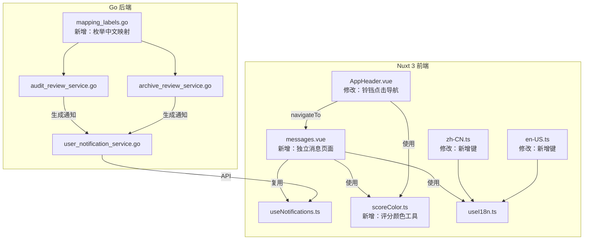

# Design Document: Notification Optimization

## Overview

对现有通知系统进行全面优化，涉及后端（Go）和前端（Nuxt 3 / Vue 3 / TypeScript）两端改动。核心目标：

1. **后端通知内容中文化**：审核完成通知的 `recommendation` 和归档复盘通知的 `overall_compliance` 字段在写入 `body` 前映射为中文
2. **评分展示统一**：所有通知 body 中评分统一放置在末尾，格式为 `评分 {分数}`
3. **评分颜色标注**：前端通过正则从 body 提取评分数值，按阈值（≥80 绿 / 60–79 橙 / <60 红）渲染彩色标签
4. **分类名称修改**：`notifications.category.audit` 从"智能审核"改为"审核工作台"
5. **独立消息页面**：新建 `/messages` 页面，左右分栏（30/70），复用 `useNotifications` composable
6. **一键已读增强**：消息页面顶部提供"全部已读"按钮，调用现有 `markAllRead` API
7. **国际化**：所有新增文案同时提供中英文翻译

## Architecture

### 系统架构变更



### 改动范围

| 层级 | 文件 | 改动类型 |
|------|------|----------|
| 后端 | `go-service/internal/service/audit_review_service.go` | 修改：通知 body 格式化 |
| 后端 | `go-service/internal/service/archive_review_service.go` | 修改：通知 body 格式化 |
| 后端 | `go-service/internal/pkg/label/label.go`（新建） | 新增：枚举值中文映射函数 |
| 前端 | `frontend/components/AppHeader.vue` | 修改：铃铛点击行为、body 评分颜色渲染 |
| 前端 | `frontend/pages/messages.vue`（新建） | 新增：独立消息页面 |
| 前端 | `frontend/utils/scoreColor.ts`（新建） | 新增：评分提取与颜色映射工具函数 |
| 前端 | `frontend/locales/zh-CN.ts` | 修改：新增/修改 i18n 键 |
| 前端 | `frontend/locales/en-US.ts` | 修改：新增/修改 i18n 键 |

## Components and Interfaces

### 1. 后端枚举映射模块 `label.go`

新建 `go-service/internal/pkg/label/label.go`，提供纯函数映射：

```go
package label

// RecommendationZh 将审核建议英文值映射为中文。
// 未知值原样返回。
func RecommendationZh(val string) string {
    m := map[string]string{
        "approve": "通过",
        "return":  "退回",
        "review":  "人工复核",
    }
    if zh, ok := m[val]; ok {
        return zh
    }
    return val
}

// ComplianceZh 将合规性英文值映射为中文。
// 未知值原样返回。
func ComplianceZh(val string) string {
    m := map[string]string{
        "compliant":            "合规",
        "non_compliant":        "不合规",
        "partially_compliant":  "部分合规",
    }
    if zh, ok := m[val]; ok {
        return zh
    }
    return val
}
```

### 2. 后端通知 body 格式化变更

**audit_review_service.go** — 审核完成通知 body 变更：

```go
// 变更前：
fmt.Sprintf("评分 %d，建议：%s", parsed.OverallScore, parsed.Recommendation)
// 变更后：
fmt.Sprintf("建议：%s，评分 %d", label.RecommendationZh(parsed.Recommendation), parsed.OverallScore)
```

**archive_review_service.go** — 归档复盘通知 body 变更：

```go
// 变更前：
fmt.Sprintf("合规性：%s，评分 %d", parsed.OverallCompliance, parsed.OverallScore)
// 变更后：
fmt.Sprintf("合规性：%s，评分 %d", label.ComplianceZh(parsed.OverallCompliance), parsed.OverallScore)
```

未知值走 fallback（原样写入），同时在调用处记录 `log.Warn`。

### 3. 前端评分颜色工具 `scoreColor.ts`

新建 `frontend/utils/scoreColor.ts`：

```typescript
/** 从通知 body 文本中提取评分数值 */
export function extractScore(body: string): number | null {
  const match = body.match(/评分\s*(\d+)/)
  return match ? Number(match[1]) : null
}

/** 根据评分返回语义色 CSS 变量名 */
export function scoreColor(score: number): string {
  if (score >= 80) return 'var(--color-success)'
  if (score >= 60) return 'var(--color-warning)'
  return 'var(--color-danger)'
}
```

### 4. AppHeader.vue 变更

- 铃铛图标点击行为从打开下拉面板改为 `navigateTo('/messages')`
- 移除通知下拉面板（`<a-dropdown>` 包裹的通知列表）
- 保留未读角标 `<a-badge>`
- 移除 `notifOpen`、`onNotifItemClick`、`handleMarkAllNotificationsRead` 等相关逻辑

### 5. 消息页面 `messages.vue`

路由：`/messages`（Nuxt 文件系统路由自动注册）

```typescript
// 核心逻辑
const { items, unreadCount, listLoading, refreshList, markOneRead, markAllRead, formatRelative } = useNotifications()
const { t, te } = useI18n()

const selectedId = ref<string | null>(null)
const selectedItem = computed(() => items.value.find(i => i.id === selectedId.value) ?? null)

async function onSelectMessage(item: UserNotificationItem) {
  selectedId.value = item.id
  if (!item.read) await markOneRead(item.id)
}

async function onMarkAllRead() {
  await markAllRead()
}
```

布局结构：

```
┌─────────────────────────────────────────────────┐
│ 消息中心                        [全部已读] 按钮  │
├──────────────┬──────────────────────────────────┤
│ 消息列表 30% │ 消息详情 70%                      │
│              │                                  │
│ [分类] 标题  │ 标题                              │
│ 正文摘要...  │ 分类 · 时间                       │
│ 时间         │                                  │
│              │ 正文内容（含评分颜色标注）          │
│ ...          │                                  │
└──────────────┴──────────────────────────────────┘
```

### 6. 国际化键新增

| 键 | 中文 | 英文 |
|----|------|------|
| `messages.title` | 消息中心 | Messages |
| `messages.empty` | 暂无消息 | No messages |
| `messages.emptyDetail` | 请从左侧列表选择一条消息查看详情 | Select a message from the list to view details |
| `messages.markAllRead` | 全部已读 | Mark all as read |
| `messages.noMessages` | 暂无消息记录 | No messages yet |
| `notifications.category.audit` | 审核工作台 | Audit Workbench |
| `messages.score.high` | 高分 | High score |
| `messages.score.medium` | 中等 | Medium score |
| `messages.score.low` | 低分 | Low score |

## Data Models

### 现有数据模型（无变更）

**UserNotification（PostgreSQL）**

| 字段 | 类型 | 说明 |
|------|------|------|
| id | UUID | 主键 |
| user_id | UUID | 用户 ID |
| role_assignment_id | UUID | 角色分配 ID |
| category | VARCHAR(64) | 分类（audit / archive / cron / general 等） |
| title | TEXT | 标题 |
| body | TEXT | 正文（本次优化改变其内容格式） |
| link_path | TEXT | 关联页面路径 |
| read_at | TIMESTAMP | 已读时间（NULL 表示未读） |
| metadata | JSONB | 扩展元数据 |
| created_at | TIMESTAMP | 创建时间 |

**UserNotificationItem（前端 TypeScript 接口，无变更）**

```typescript
interface UserNotificationItem {
  id: string
  category: string
  title: string
  body?: string
  link_path?: string
  read: boolean
  created_at: string
}
```

### 数据流变更

body 字段内容格式变更（仅后端生成逻辑改变，数据库 schema 不变）：

| 场景 | 变更前 | 变更后 |
|------|--------|--------|
| 审核完成 | `评分 85，建议：approve` | `建议：通过，评分 85` |
| 归档复盘 | `合规性：non_compliant，评分 72` | `合规性：不合规，评分 72` |


## Correctness Properties

*A property is a characteristic or behavior that should hold true across all valid executions of a system — essentially, a formal statement about what the system should do. Properties serve as the bridge between human-readable specifications and machine-verifiable correctness guarantees.*

### Property 1: Enum-to-Chinese mapping correctness

*For any* known enum value in the recommendation set {approve, return, review} or the compliance set {compliant, non_compliant, partially_compliant}, the corresponding mapping function SHALL return the correct Chinese translation, and the result SHALL NOT equal the original English input.

**Validates: Requirements 1.1, 2.1**

### Property 2: Unknown value passthrough

*For any* string that is NOT in the known mapping set (neither a valid recommendation nor a valid compliance value), the mapping function SHALL return the original input string unchanged.

**Validates: Requirements 1.3, 2.3**

### Property 3: Score color classification completeness

*For any* integer score, the score color function SHALL return exactly one of three colors: success (green) for score ≥ 80, warning (orange) for 60 ≤ score < 80, and danger (red) for score < 60. The three ranges SHALL be exhaustive and mutually exclusive — every integer maps to exactly one color.

**Validates: Requirements 4.1, 4.2, 4.3**

### Property 4: Score regex extraction round-trip

*For any* string containing the pattern "评分 N" where N is a non-negative integer, the `extractScore` function SHALL return N. For any string NOT containing this pattern, the function SHALL return null.

**Validates: Requirements 4.4**

### Property 5: Notification body format — score at end

*For any* audit notification body generated with a valid recommendation and score, the body string SHALL end with "评分 {score}" where {score} is the numeric score value. Similarly, for any archive notification body generated with a valid compliance and score, the body string SHALL end with "评分 {score}".

**Validates: Requirements 3.1, 3.2, 3.3**

## Error Handling

### 后端

| 场景 | 处理方式 |
|------|----------|
| `recommendation` 值不在已知映射中 | 原样写入 body，记录 `log.Warn("未知 recommendation 值: %s", val)` |
| `overall_compliance` 值不在已知映射中 | 原样写入 body，记录 `log.Warn("未知 overall_compliance 值: %s", val)` |
| 通知写入失败（`CreateByTenant` 内部） | 现有逻辑已静默忽略，不影响主流程 |

### 前端

| 场景 | 处理方式 |
|------|----------|
| body 中无法匹配评分正则 | 不渲染颜色标签，body 原样展示 |
| `refreshList` 请求失败 | 现有逻辑已处理（清空列表） |
| `markOneRead` / `markAllRead` 失败 | 现有逻辑已静默忽略 |
| 消息页面无数据 | 展示空状态提示文案（i18n） |
| i18n 键缺失 | `useI18n.t()` 已有 fallback 机制（返回 key 本身） |

## Testing Strategy

### 属性测试（Property-Based Testing）

本特性包含多个纯函数映射和正则提取逻辑，适合使用属性测试验证正确性。

**后端（Go）**：使用 `testing/quick` 或 `gopter` 库
- 每个属性测试最少运行 100 次迭代
- 标签格式：`Feature: notification-optimization, Property {N}: {description}`

**前端（TypeScript）**：使用 `fast-check` 库
- 每个属性测试最少运行 100 次迭代
- 标签格式：`Feature: notification-optimization, Property {N}: {description}`

### 测试矩阵

| 属性 | 测试类型 | 测试目标 | 对应需求 |
|------|----------|----------|----------|
| Property 1 | PBT (Go) | `RecommendationZh` / `ComplianceZh` 已知值映射 | 1.1, 2.1 |
| Property 2 | PBT (Go) | 未知值 fallback | 1.3, 2.3 |
| Property 3 | PBT (TS) | `scoreColor` 函数颜色分类 | 4.1, 4.2, 4.3 |
| Property 4 | PBT (TS) | `extractScore` 正则提取 | 4.4 |
| Property 5 | PBT (Go) | 通知 body 格式（评分在末尾） | 3.1, 3.2, 3.3 |

### 单元测试（Example-Based）

| 测试 | 类型 | 说明 |
|------|------|------|
| 审核通知 body 格式 | Example | 验证 `建议：通过，评分 85` 格式 |
| 归档通知 body 格式 | Example | 验证 `合规性：合规，评分 90` 格式 |
| 分类标签 i18n | Smoke | 验证 `notifications.category.audit` 键值正确 |
| 消息页面路由 | Example | 验证 `/messages` 页面可访问 |
| 空状态渲染 | Example | 验证无消息时展示提示文案 |
| 全部已读按钮状态 | Example | 验证无未读时按钮隐藏/禁用 |

### 集成测试

| 测试 | 说明 |
|------|------|
| 审核完成 → 通知生成 | 端到端验证审核完成后通知 body 包含中文建议和评分 |
| 归档复盘 → 通知生成 | 端到端验证归档完成后通知 body 包含中文合规性和评分 |
| 消息页面交互流 | 打开页面 → 选择消息 → 标记已读 → 全部已读 |
