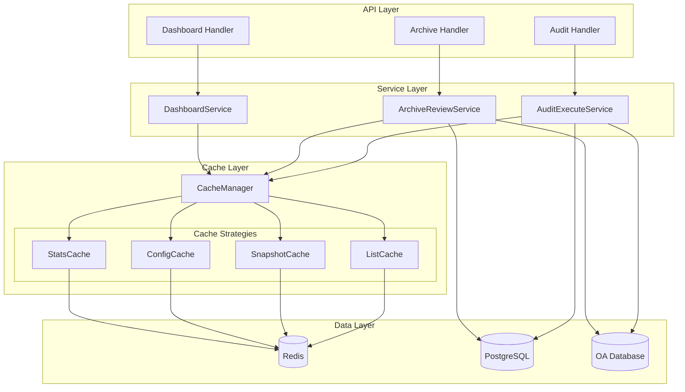
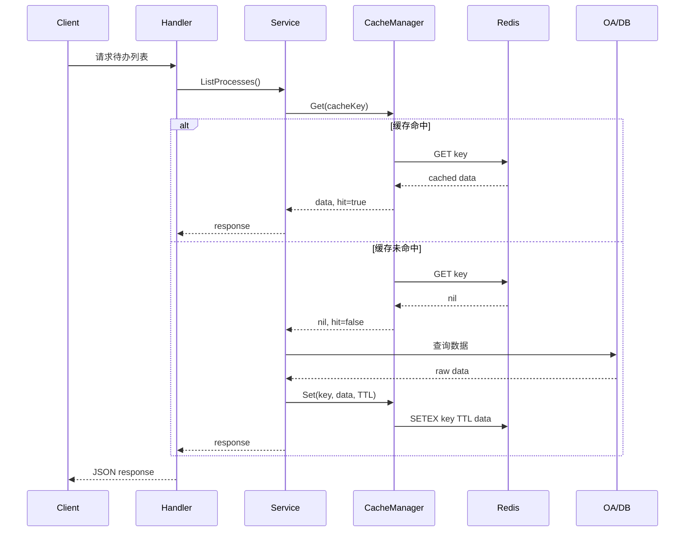

# Redis Cache Optimization - Technical Design Document

## Overview

本设计文档描述 OA 智审系统 Redis 缓存优化方案的技术实现。通过引入统一的缓存管理组件（Cache Manager），为审核工作台和归档复盘模块提供高性能的数据缓存能力，显著减少对 OA 数据库的直接查询压力。

### 设计目标

1. **性能提升**：缓存命中时响应时间 < 200ms，缓存操作延迟 < 50ms
2. **数据一致性**：通过合理的 TTL 和主动失效策略确保数据准确性
3. **高可用性**：Redis 不可用时自动降级为直接查询，不影响业务
4. **可观测性**：提供缓存命中率、操作统计等监控指标

### 技术选型

- **缓存存储**：Redis（已集成，使用 `github.com/redis/go-redis/v9`）
- **序列化格式**：JSON（兼容现有数据结构）
- **缓存策略**：Cache-Aside Pattern（旁路缓存模式）

## Architecture

### 系统架构图



### 缓存数据流



## Components and Interfaces

### 1. CacheManager 核心组件

```go
// Package cache 提供统一的缓存管理能力
package cache

import (
    "context"
    "encoding/json"
    "time"
    
    "github.com/redis/go-redis/v9"
    "go.uber.org/zap"
)

// CacheManager 缓存管理器，提供统一的缓存读写接口
type CacheManager struct {
    rdb     *redis.Client
    logger  *zap.Logger
    enabled bool
    stats   *CacheStats
}

// CacheStats 缓存统计信息
type CacheStats struct {
    Hits       int64  // 命中次数
    Misses     int64  // 未命中次数
    Errors     int64  // 错误次数
    mu         sync.RWMutex
}

// Config 缓存配置
type Config struct {
    Enabled          bool          // 是否启用缓存
    DefaultTTL       time.Duration // 默认 TTL
    HitRateThreshold float64       // 命中率告警阈值
}

// NewCacheManager 创建缓存管理器实例
func NewCacheManager(rdb *redis.Client, logger *zap.Logger, cfg Config) *CacheManager

// Get 从缓存获取数据，返回是否命中
func (m *CacheManager) Get(ctx context.Context, key string, dest interface{}) (bool, error)

// Set 写入缓存，支持自定义 TTL
func (m *CacheManager) Set(ctx context.Context, key string, value interface{}, ttl time.Duration) error

// Delete 删除指定缓存键
func (m *CacheManager) Delete(ctx context.Context, key string) error

// DeleteByPrefix 按前缀批量删除缓存键
func (m *CacheManager) DeleteByPrefix(ctx context.Context, prefix string) error

// Exists 检查缓存键是否存在
func (m *CacheManager) Exists(ctx context.Context, key string) (bool, error)

// GetStats 获取缓存统计信息
func (m *CacheManager) GetStats() CacheStatsSnapshot

// IsEnabled 检查缓存是否启用
func (m *CacheManager) IsEnabled() bool
```

### 2. 缓存键生成器

```go
// CacheKeyBuilder 缓存键构建器
type CacheKeyBuilder struct {
    module   string
    tenantID string
}

// NewKeyBuilder 创建键构建器
func NewKeyBuilder(module string, tenantID uuid.UUID) *CacheKeyBuilder

// TodoList 生成待办列表缓存键
// 格式: audit:todo:{tenant_id}:{user_id}:{filter_hash}
func (b *CacheKeyBuilder) TodoList(userID uuid.UUID, filterHash string) string

// ArchiveList 生成归档列表缓存键
// 格式: archive:list:{tenant_id}:{user_id}:{filter_hash}
func (b *CacheKeyBuilder) ArchiveList(userID uuid.UUID, filterHash string) string

// ProcessConfig 生成流程配置缓存键
// 格式: {module}:config:{tenant_id}:{process_type}
func (b *CacheKeyBuilder) ProcessConfig(processType string) string

// Snapshot 生成快照缓存键
// 格式: {module}:snapshot:{tenant_id}:{process_ids_hash}
func (b *CacheKeyBuilder) Snapshot(processIDsHash string) string

// Stats 生成统计数据缓存键
// 格式: {module}:stats:{tenant_id}:{user_id}:{date_range_hash}
func (b *CacheKeyBuilder) Stats(userID uuid.UUID, dateRangeHash string) string

// Dashboard 生成仪表盘缓存键
// 格式: dashboard:{tenant_id}:{user_id}:{role}
func (b *CacheKeyBuilder) Dashboard(userID uuid.UUID, role string) string
```

### 3. 缓存失效管理器

```go
// InvalidationManager 缓存失效管理器
type InvalidationManager struct {
    cache  *CacheManager
    logger *zap.Logger
}

// NewInvalidationManager 创建失效管理器
func NewInvalidationManager(cache *CacheManager, logger *zap.Logger) *InvalidationManager

// InvalidateUserTodoCache 清除用户待办列表缓存
func (m *InvalidationManager) InvalidateUserTodoCache(ctx context.Context, tenantID, userID uuid.UUID) error

// InvalidateUserArchiveCache 清除用户归档列表缓存
func (m *InvalidationManager) InvalidateUserArchiveCache(ctx context.Context, tenantID, userID uuid.UUID) error

// InvalidateSnapshotCache 清除快照缓存
func (m *InvalidationManager) InvalidateSnapshotCache(ctx context.Context, tenantID uuid.UUID, module string) error

// InvalidateConfigCache 清除配置缓存
func (m *InvalidationManager) InvalidateConfigCache(ctx context.Context, tenantID uuid.UUID, module string) error

// InvalidateStatsCache 清除统计缓存
func (m *InvalidationManager) InvalidateStatsCache(ctx context.Context, tenantID uuid.UUID, module string) error

// InvalidateTenantCache 清除租户全部缓存
func (m *InvalidationManager) InvalidateTenantCache(ctx context.Context, tenantID uuid.UUID) error

// InvalidateModuleCache 清除指定模块全部缓存
func (m *InvalidationManager) InvalidateModuleCache(ctx context.Context, module string) error
```

### 4. 服务层集成接口

```go
// CacheableService 可缓存服务接口
type CacheableService interface {
    // GetCacheManager 获取缓存管理器
    GetCacheManager() *CacheManager
    
    // GetInvalidationManager 获取失效管理器
    GetInvalidationManager() *InvalidationManager
}

// AuditCacheService 审核缓存服务扩展
type AuditCacheService struct {
    *AuditExecuteService
    cache       *CacheManager
    invalidator *InvalidationManager
}

// ArchiveCacheService 归档缓存服务扩展
type ArchiveCacheService struct {
    *ArchiveReviewService
    cache       *CacheManager
    invalidator *InvalidationManager
}
```

## Data Models

### 缓存数据结构

```go
// CachedTodoList 缓存的待办列表
type CachedTodoList struct {
    Items     []map[string]interface{} `json:"items"`
    Total     int                      `json:"total"`
    CachedAt  time.Time                `json:"cached_at"`
    FilterHash string                  `json:"filter_hash"`
}

// CachedArchiveList 缓存的归档列表
type CachedArchiveList struct {
    Items     []map[string]interface{} `json:"items"`
    Total     int                      `json:"total"`
    Page      int                      `json:"page"`
    PageSize  int                      `json:"page_size"`
    CachedAt  time.Time                `json:"cached_at"`
    FilterHash string                  `json:"filter_hash"`
}

// CachedProcessConfig 缓存的流程配置
type CachedProcessConfig struct {
    Config    interface{} `json:"config"`
    Rules     interface{} `json:"rules"`
    CachedAt  time.Time   `json:"cached_at"`
}

// CachedSnapshot 缓存的快照映射
type CachedSnapshot struct {
    Snapshots map[string]interface{} `json:"snapshots"`
    CachedAt  time.Time              `json:"cached_at"`
}

// CachedStats 缓存的统计数据
type CachedStats struct {
    Stats     interface{} `json:"stats"`
    CachedAt  time.Time   `json:"cached_at"`
}

// CacheStatsSnapshot 缓存统计快照
type CacheStatsSnapshot struct {
    Hits      int64   `json:"hits"`
    Misses    int64   `json:"misses"`
    Errors    int64   `json:"errors"`
    HitRate   float64 `json:"hit_rate"`
    KeyCount  int64   `json:"key_count"`
}
```

### 缓存键命名规范

| 数据类型 | 键格式 | TTL | 示例 |
|---------|--------|-----|------|
| 待办列表 | `audit:todo:{tenant_id}:{user_id}:{filter_hash}` | 3min | `audit:todo:abc123:user456:f7a8b9` |
| 归档列表 | `archive:list:{tenant_id}:{user_id}:{filter_hash}` | 5min | `archive:list:abc123:user456:c3d4e5` |
| 审核配置 | `audit:config:{tenant_id}:{process_type}` | 10min | `audit:config:abc123:expense` |
| 归档配置 | `archive:config:{tenant_id}:{process_type}` | 10min | `archive:config:abc123:contract` |
| 审核快照 | `audit:snapshot:{tenant_id}:{process_ids_hash}` | 5min | `audit:snapshot:abc123:h1i2j3` |
| 归档快照 | `archive:snapshot:{tenant_id}:{process_ids_hash}` | 5min | `archive:snapshot:abc123:k4l5m6` |
| 审核统计 | `audit:stats:{tenant_id}:{user_id}:{date_range_hash}` | 5min | `audit:stats:abc123:user456:n7o8p9` |
| 归档统计 | `archive:stats:{tenant_id}:{user_id}:{date_range_hash}` | 5min | `archive:stats:abc123:user456:q1r2s3` |
| 仪表盘 | `dashboard:{tenant_id}:{user_id}:{role}` | 2min | `dashboard:abc123:user456:admin` |

### Filter Hash 计算

```go
// ComputeFilterHash 计算筛选条件的哈希值
func ComputeFilterHash(params interface{}) string {
    data, _ := json.Marshal(params)
    hash := sha256.Sum256(data)
    return hex.EncodeToString(hash[:8]) // 取前 8 字节
}
```

</text>
</invoke>


## Correctness Properties

*A property is a characteristic or behavior that should hold true across all valid executions of a system—essentially, a formal statement about what the system should do. Properties serve as the bridge between human-readable specifications and machine-verifiable correctness guarantees.*


### Property 1: 缓存往返一致性

*For any* 有效的缓存键和可序列化的数据对象，执行 Set 操作后立即执行 Get 操作，应返回与原始数据等价的对象。

**Validates: Requirements 1.1, 1.6**

### Property 2: 缓存键格式规范

*For any* 模块名、租户ID、资源类型和标识符的组合，生成的缓存键应符合 `{module}:{tenant_id}:{resource}:{identifier}` 的命名规范，且不同参数组合生成的键应唯一。

**Validates: Requirements 1.5, 2.3, 2.6, 3.3, 3.6, 4.1, 4.2, 5.1, 5.2, 5.5**

### Property 3: 前缀批量删除完整性

*For any* 缓存键前缀和该前缀下的任意数量缓存键，执行 DeleteByPrefix 操作后，所有以该前缀开头的键都应不存在，而其他前缀的键应保持不变。

**Validates: Requirements 1.3, 6.4, 6.5**

### Property 4: 审核操作后缓存失效

*For any* 用户执行审核操作（包括审核执行、规则变更），该用户的待办列表缓存、相关快照缓存和审核配置缓存应被清除。

**Validates: Requirements 2.5, 4.4, 6.2**

### Property 5: 复盘操作后缓存失效

*For any* 用户执行复盘操作（包括复盘执行、规则变更），该用户的归档列表缓存、相关快照缓存和归档配置缓存应被清除。

**Validates: Requirements 3.5, 4.5, 6.3**

### Property 6: 租户配置变更后缓存失效

*For any* 租户配置变更（包括租户配置、OA 连接配置），该租户的所有配置相关缓存和 OA 数据相关缓存应被清除，其他租户的缓存应保持不变。

**Validates: Requirements 6.1, 6.6**

### Property 7: 缓存统计准确性

*For any* 缓存操作序列（包含 Get 命中、Get 未命中、Set、Delete），统计接口返回的命中次数、未命中次数应与实际操作次数一致，命中率计算应正确。

**Validates: Requirements 7.1, 7.5**

### Property 8: 分页缓存一致性

*For any* 超过 1000 条的数据集和任意分页参数（page, pageSize），分页缓存的数据应与原始数据的对应分页切片一致，且不同分页参数的缓存应相互独立。

**Validates: Requirements 8.4**

## Error Handling

### 错误处理策略

| 错误场景 | 处理策略 | 日志级别 |
|---------|---------|---------|
| Redis 连接失败 | 降级为直接查询数据源 | WARN |
| 缓存序列化失败 | 跳过缓存，直接返回数据 | ERROR |
| 缓存反序列化失败 | 删除损坏缓存，重新查询 | WARN |
| 缓存写入失败 | 忽略错误，返回查询结果 | WARN |
| 缓存删除失败 | 记录错误，不影响业务 | ERROR |
| 批量删除超时 | 分批重试，最终一致 | WARN |

### 降级机制

```go
// GetWithFallback 带降级的缓存获取
func (m *CacheManager) GetWithFallback(ctx context.Context, key string, dest interface{}, fallback func() (interface{}, error)) error {
    // 1. 尝试从缓存获取
    if m.IsEnabled() {
        hit, err := m.Get(ctx, key, dest)
        if err != nil {
            m.logger.Warn("缓存读取失败，降级为直接查询",
                zap.String("key", key),
                zap.Error(err),
            )
        } else if hit {
            return nil
        }
    }
    
    // 2. 缓存未命中或禁用，执行回源查询
    data, err := fallback()
    if err != nil {
        return err
    }
    
    // 3. 尝试写入缓存（失败不影响返回）
    if m.IsEnabled() {
        if setErr := m.Set(ctx, key, data, m.defaultTTL); setErr != nil {
            m.logger.Warn("缓存写入失败",
                zap.String("key", key),
                zap.Error(setErr),
            )
        }
    }
    
    // 4. 将数据复制到目标
    return copyTo(data, dest)
}
```

### 错误码定义

```go
const (
    ErrCacheDisabled     = 50001 // 缓存功能已禁用
    ErrCacheConnFailed   = 50002 // Redis 连接失败
    ErrCacheSerialize    = 50003 // 序列化失败
    ErrCacheDeserialize  = 50004 // 反序列化失败
    ErrCacheKeyInvalid   = 50005 // 缓存键格式无效
    ErrCacheOperationFailed = 50006 // 缓存操作失败
)
```

## Testing Strategy

### 测试方法概述

本功能采用双重测试策略：
- **单元测试**：验证具体示例、边界条件和错误处理
- **属性测试**：验证跨所有输入的通用属性

### 属性测试配置

- **测试框架**：使用 `github.com/leanovate/gopter` 进行属性测试
- **最小迭代次数**：每个属性测试至少运行 100 次
- **标签格式**：`Feature: redis-cache-optimization, Property {number}: {property_text}`

### 测试用例分类

#### 属性测试（Property-Based Tests）

| 属性 | 测试文件 | 描述 |
|-----|---------|------|
| Property 1 | `cache_roundtrip_test.go` | 缓存往返一致性 |
| Property 2 | `cache_key_format_test.go` | 缓存键格式规范 |
| Property 3 | `cache_prefix_delete_test.go` | 前缀批量删除完整性 |
| Property 4 | `audit_cache_invalidation_test.go` | 审核操作后缓存失效 |
| Property 5 | `archive_cache_invalidation_test.go` | 复盘操作后缓存失效 |
| Property 6 | `tenant_cache_invalidation_test.go` | 租户配置变更后缓存失效 |
| Property 7 | `cache_stats_test.go` | 缓存统计准确性 |
| Property 8 | `paged_cache_test.go` | 分页缓存一致性 |

#### 单元测试（Example-Based Tests）

| 测试场景 | 测试文件 | 描述 |
|---------|---------|------|
| TTL 配置 | `cache_ttl_test.go` | 验证各类缓存的 TTL 配置正确 |
| 降级机制 | `cache_fallback_test.go` | 验证 Redis 不可用时的降级行为 |
| 错误处理 | `cache_error_test.go` | 验证各类错误场景的处理 |
| 日志记录 | `cache_logging_test.go` | 验证日志记录的完整性 |

#### 集成测试（Integration Tests）

| 测试场景 | 测试文件 | 描述 |
|---------|---------|------|
| 缓存优先策略 | `cache_priority_integration_test.go` | 验证缓存命中时不查询数据源 |
| 性能指标 | `cache_performance_test.go` | 验证响应时间和延迟要求 |
| 预热机制 | `cache_warmup_test.go` | 验证系统启动时的缓存预热 |

### 测试数据生成器

```go
// 用于属性测试的数据生成器
func genCacheKey() gopter.Gen {
    return gen.Struct(reflect.TypeOf(CacheKeyParams{}), map[string]gopter.Gen{
        "Module":     gen.OneConstOf("audit", "archive", "dashboard"),
        "TenantID":   genUUID(),
        "Resource":   gen.OneConstOf("todo", "list", "config", "snapshot", "stats"),
        "Identifier": gen.AlphaString(),
    })
}

func genCacheValue() gopter.Gen {
    return gen.OneGenOf(
        gen.MapOf(gen.AlphaString(), gen.AnyString()),
        gen.SliceOf(gen.AnyString()),
        gen.Struct(reflect.TypeOf(CachedTodoList{}), ...),
    )
}
```

### 测试覆盖率目标

- 核心缓存组件（CacheManager）：≥ 90%
- 缓存键生成器：≥ 95%
- 失效管理器：≥ 85%
- 服务层集成：≥ 80%


## Integration with Existing Code

### 目录结构

```
go-service/internal/
├── cache/                          # 新增：缓存模块
│   ├── manager.go                  # CacheManager 核心实现
│   ├── key_builder.go              # 缓存键生成器
│   ├── invalidation.go             # 缓存失效管理器
│   ├── stats.go                    # 缓存统计
│   ├── config.go                   # 缓存配置
│   └── manager_test.go             # 单元测试
├── pkg/
│   └── cache/                      # 新增：缓存工具包
│       └── hash.go                 # Filter Hash 计算工具
├── service/
│   ├── audit_review_service.go     # 修改：集成缓存
│   ├── archive_review_service.go   # 修改：集成缓存
│   ├── dashboard_overview_service.go # 修改：集成缓存
│   └── ...
└── ...
```

### 服务层集成示例

#### AuditExecuteService 集成

```go
// audit_review_service.go 修改

type AuditExecuteService struct {
    // ... 现有字段
    cache       *cache.CacheManager      // 新增
    invalidator *cache.InvalidationManager // 新增
}

// ListPendingProcesses 待办列表查询（带缓存）
func (s *AuditExecuteService) ListPendingProcesses(c *gin.Context, params dto.AuditListParams) (*dto.AuditProcessListResponse, error) {
    tenantID, userID, err := s.extractIDs(c)
    if err != nil {
        return nil, err
    }
    
    // 1. 构建缓存键
    keyBuilder := cache.NewKeyBuilder("audit", tenantID)
    filterHash := cache.ComputeFilterHash(params)
    cacheKey := keyBuilder.TodoList(userID, filterHash)
    
    // 2. 尝试从缓存获取
    var cached cache.CachedTodoList
    if hit, _ := s.cache.Get(c.Request.Context(), cacheKey, &cached); hit {
        return &dto.AuditProcessListResponse{
            Items: cached.Items,
            Total: cached.Total,
        }, nil
    }
    
    // 3. 缓存未命中，从 OA 查询
    result, err := s.fetchFromOA(c, params)
    if err != nil {
        return nil, err
    }
    
    // 4. 写入缓存
    toCache := cache.CachedTodoList{
        Items:      result.Items,
        Total:      result.Total,
        CachedAt:   time.Now(),
        FilterHash: filterHash,
    }
    _ = s.cache.Set(c.Request.Context(), cacheKey, toCache, 3*time.Minute)
    
    return result, nil
}

// Execute 审核执行（带缓存失效）
func (s *AuditExecuteService) Execute(c *gin.Context, req *AuditExecuteRequest) (*AuditExecuteResponse, error) {
    // ... 现有逻辑
    
    // 审核完成后清除缓存
    defer func() {
        ctx := context.Background()
        _ = s.invalidator.InvalidateUserTodoCache(ctx, tenantID, userID)
        _ = s.invalidator.InvalidateSnapshotCache(ctx, tenantID, "audit")
        _ = s.invalidator.InvalidateStatsCache(ctx, tenantID, "audit")
    }()
    
    // ... 继续现有逻辑
}
```

#### ArchiveReviewService 集成

```go
// archive_review_service.go 修改

type ArchiveReviewService struct {
    // ... 现有字段
    cache       *cache.CacheManager
    invalidator *cache.InvalidationManager
}

// ListProcessesPaged 归档列表分页查询（带缓存）
func (s *ArchiveReviewService) ListProcessesPaged(c *gin.Context, params dto.ArchiveListParams) (*dto.ArchiveProcessListResponse, error) {
    tenantID, userID, err := s.extractIDs(c)
    if err != nil {
        return nil, err
    }
    
    // 1. 构建缓存键
    keyBuilder := cache.NewKeyBuilder("archive", tenantID)
    filterHash := cache.ComputeFilterHash(params)
    cacheKey := keyBuilder.ArchiveList(userID, filterHash)
    
    // 2. 尝试从缓存获取
    var cached cache.CachedArchiveList
    if hit, _ := s.cache.Get(c.Request.Context(), cacheKey, &cached); hit {
        return &dto.ArchiveProcessListResponse{
            Items:    cached.Items,
            Total:    cached.Total,
            Page:     cached.Page,
            PageSize: cached.PageSize,
        }, nil
    }
    
    // 3. 缓存未命中，执行原有查询逻辑
    // ... 现有的 listArchiveBySnapshotPaged 或 listArchiveUnauditedPaged 逻辑
    
    // 4. 写入缓存
    _ = s.cache.Set(c.Request.Context(), cacheKey, toCache, 5*time.Minute)
    
    return result, nil
}
```

### 依赖注入修改

```go
// cmd/server/main.go 修改

func main() {
    // ... 现有初始化
    
    // 初始化缓存管理器
    cacheConfig := cache.Config{
        Enabled:          true,
        DefaultTTL:       5 * time.Minute,
        HitRateThreshold: 0.5,
    }
    cacheManager := cache.NewCacheManager(rdb, logger, cacheConfig)
    invalidationManager := cache.NewInvalidationManager(cacheManager, logger)
    
    // 修改服务构造函数，注入缓存依赖
    auditSvc := service.NewAuditExecuteService(
        // ... 现有参数
        cacheManager,
        invalidationManager,
    )
    
    archiveSvc := service.NewArchiveReviewService(
        // ... 现有参数
        cacheManager,
        invalidationManager,
    )
    
    // ... 继续现有逻辑
}
```

### 配置扩展

```yaml
# config.yaml 新增配置项

cache:
  enabled: true                    # 是否启用缓存
  default_ttl: 5m                  # 默认 TTL
  hit_rate_threshold: 0.5          # 命中率告警阈值
  
  # 各模块 TTL 配置
  ttl:
    audit_todo: 3m                 # 待办列表
    archive_list: 5m               # 归档列表
    process_config: 10m            # 流程配置
    snapshot: 5m                   # 快照数据
    stats: 5m                      # 统计数据
    dashboard: 2m                  # 仪表盘
```

### 管理接口

```go
// handler/cache_admin_handler.go 新增

type CacheAdminHandler struct {
    cache       *cache.CacheManager
    invalidator *cache.InvalidationManager
}

// GetStats 获取缓存统计
// GET /api/admin/cache/stats
func (h *CacheAdminHandler) GetStats(c *gin.Context) {
    stats := h.cache.GetStats()
    response.Success(c, stats)
}

// ClearTenantCache 清除租户缓存
// DELETE /api/admin/cache/tenant/:tenant_id
func (h *CacheAdminHandler) ClearTenantCache(c *gin.Context) {
    tenantID, _ := uuid.Parse(c.Param("tenant_id"))
    err := h.invalidator.InvalidateTenantCache(c.Request.Context(), tenantID)
    if err != nil {
        response.Error(c, errcode.ErrCacheOperationFailed, err.Error())
        return
    }
    response.Success(c, nil)
}

// ClearModuleCache 清除模块缓存
// DELETE /api/admin/cache/module/:module
func (h *CacheAdminHandler) ClearModuleCache(c *gin.Context) {
    module := c.Param("module")
    err := h.invalidator.InvalidateModuleCache(c.Request.Context(), module)
    if err != nil {
        response.Error(c, errcode.ErrCacheOperationFailed, err.Error())
        return
    }
    response.Success(c, nil)
}

// ToggleCache 开关缓存
// POST /api/admin/cache/toggle
func (h *CacheAdminHandler) ToggleCache(c *gin.Context) {
    var req struct {
        Enabled bool `json:"enabled"`
    }
    if err := c.ShouldBindJSON(&req); err != nil {
        response.Error(c, errcode.ErrParamValidation, err.Error())
        return
    }
    h.cache.SetEnabled(req.Enabled)
    response.Success(c, nil)
}
```

### 路由注册

```go
// router/router.go 修改

func SetupRouter(...) {
    // ... 现有路由
    
    // 缓存管理路由（仅超级管理员）
    adminGroup := r.Group("/api/admin")
    adminGroup.Use(middleware.JWT(rdb), middleware.RequireSuperAdmin())
    {
        cacheHandler := handler.NewCacheAdminHandler(cacheManager, invalidationManager)
        adminGroup.GET("/cache/stats", cacheHandler.GetStats)
        adminGroup.DELETE("/cache/tenant/:tenant_id", cacheHandler.ClearTenantCache)
        adminGroup.DELETE("/cache/module/:module", cacheHandler.ClearModuleCache)
        adminGroup.POST("/cache/toggle", cacheHandler.ToggleCache)
    }
}
```

### 迁移步骤

1. **Phase 1: 基础设施**
   - 创建 `internal/cache` 包
   - 实现 CacheManager、KeyBuilder、InvalidationManager
   - 添加单元测试

2. **Phase 2: 服务集成**
   - 修改 AuditExecuteService 集成缓存
   - 修改 ArchiveReviewService 集成缓存
   - 修改 DashboardOverviewService 集成缓存

3. **Phase 3: 管理接口**
   - 添加缓存管理 Handler
   - 注册管理路由
   - 添加配置项

4. **Phase 4: 测试与优化**
   - 属性测试
   - 集成测试
   - 性能测试
   - 监控告警配置

