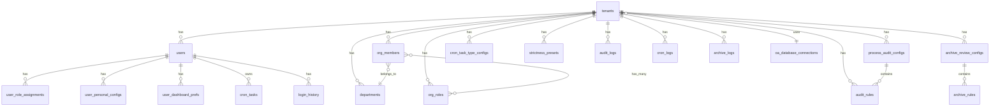

# OA 智审平台 — 数据库设计文档

> 文档版本：v1.0 | 更新日期：2026-03-02  
> 本文档定义后端数据库的完整设计，基于前端模拟数据反推，支持多版本迁移。

---

## 一、数据库选型

| 组件 | 版本 | 用途 |
|------|------|------|
| PostgreSQL | 16+ | 主数据库，结构化业务数据 |
| pgvector | 0.7+ | 向量检索，RAG 文档嵌入（Phase 2） |
| Redis | 7+ | 缓存、会话、分布式锁 |

**设计原则**：
- 所有表使用 UUID 主键（`gen_random_uuid()`）
- 所有表包含 `created_at` / `updated_at` 时间戳
- 多租户数据通过 `tenant_id` 外键隔离
- 使用 `golang-migrate` 进行版本化迁移
- JSONB 字段用于存储灵活配置

---

## 二、ER 关系总览



---

## 三、迁移版本规划

| 版本 | 文件名 | 内容 | 阶段 |
|------|--------|------|------|
| 001 | `000001_init_extensions.up.sql` | 扩展启用 (uuid-ossp, pgvector) | Phase 1 |
| 002 | `000002_tenants_users.up.sql` | 租户 + 用户 + 角色分配 | Phase 1 |
| 003 | `000003_org_structure.up.sql` | 部门 + 组织角色 + 组织成员 | Phase 1 |
| 004 | `000004_system_configs.up.sql` | 系统设置 (OA/AI/通用) | Phase 1 |
| 005 | `000005_audit_rules.up.sql` | 审核规则 + 流程配置 | Phase 2 |
| 006 | `000006_cron_tasks.up.sql` | 定时任务 | Phase 2 |
| 007 | `000007_audit_logs.up.sql` | 审核/定时/归档日志 | Phase 2 |
| 008 | `000008_user_configs.up.sql` | 用户偏好 + 仪表盘配置 | Phase 2 |
| 009 | `000009_archives.up.sql` | 归档流程 + 复核结果 | Phase 3 |
| 010 | `000010_rag_vectors.up.sql` | 文档向量表 (pgvector) | Phase 4 |

---

## 四、详细表设计

### 4.1 租户与用户 (Phase 1 — 000002)

#### tenants — 租户表

```sql
CREATE TABLE tenants (
    id              UUID PRIMARY KEY DEFAULT gen_random_uuid(),
    name            VARCHAR(255) NOT NULL,                -- 租户名称
    code            VARCHAR(100) NOT NULL UNIQUE,          -- 租户编码（唯一标识）
    description     TEXT DEFAULT '',                       -- 描述
    status          VARCHAR(20) NOT NULL DEFAULT 'active'  -- active / inactive
                    CHECK (status IN ('active', 'inactive')),
    
    -- OA 系统关联
    oa_type         VARCHAR(50) NOT NULL DEFAULT 'weaver_e9',  -- OA类型
    oa_db_connection_id UUID REFERENCES oa_database_connections(id),  -- 关联OA数据库连接
    
    -- Token 配额
    token_quota     INTEGER NOT NULL DEFAULT 10000,
    token_used      INTEGER NOT NULL DEFAULT 0,
    max_concurrency INTEGER NOT NULL DEFAULT 10,
    
    -- AI 配置（JSONB 灵活存储）
    ai_config       JSONB NOT NULL DEFAULT '{
        "default_provider": "",
        "default_model": "",
        "fallback_provider": "",
        "fallback_model": "",
        "max_tokens_per_request": 8192,
        "temperature": 0.3,
        "timeout_seconds": 60,
        "retry_count": 3
    }'::jsonb,
    
    -- 安全配置
    sso_enabled     BOOLEAN NOT NULL DEFAULT false,
    sso_endpoint    VARCHAR(500) DEFAULT '',
    
    -- 数据保留策略
    log_retention_days  INTEGER NOT NULL DEFAULT 365,
    data_retention_days INTEGER NOT NULL DEFAULT 1095,
    allow_custom_model  BOOLEAN NOT NULL DEFAULT false,
    
    -- 联系人
    contact_name    VARCHAR(100) DEFAULT '',
    contact_email   VARCHAR(255) DEFAULT '',
    contact_phone   VARCHAR(50) DEFAULT '',
    
    -- 时间戳
    created_at      TIMESTAMPTZ NOT NULL DEFAULT NOW(),
    updated_at      TIMESTAMPTZ NOT NULL DEFAULT NOW()
);

CREATE INDEX idx_tenants_code ON tenants(code);
CREATE INDEX idx_tenants_status ON tenants(status);
```

#### users — 用户表

```sql
CREATE TABLE users (
    id              UUID PRIMARY KEY DEFAULT gen_random_uuid(),
    username        VARCHAR(100) NOT NULL,
    password_hash   VARCHAR(255) NOT NULL,       -- bcrypt 哈希
    display_name    VARCHAR(100) NOT NULL,
    email           VARCHAR(255) DEFAULT '',
    phone           VARCHAR(50) DEFAULT '',
    avatar_url      VARCHAR(500) DEFAULT '',
    status          VARCHAR(20) NOT NULL DEFAULT 'active'
                    CHECK (status IN ('active', 'disabled', 'locked')),
    
    -- 安全信息
    password_changed_at TIMESTAMPTZ DEFAULT NOW(),
    login_fail_count    INTEGER NOT NULL DEFAULT 0,
    locked_until        TIMESTAMPTZ,
    
    -- 语言偏好
    locale          VARCHAR(10) DEFAULT 'zh-CN',
    date_format     VARCHAR(20) DEFAULT 'YYYY-MM-DD',
    
    created_at      TIMESTAMPTZ NOT NULL DEFAULT NOW(),
    updated_at      TIMESTAMPTZ NOT NULL DEFAULT NOW()
);

CREATE UNIQUE INDEX idx_users_username ON users(username);
```

#### user_role_assignments — 用户角色分配表

```sql
-- 一个用户可以有多个角色分配（跨租户、多角色）
CREATE TABLE user_role_assignments (
    id              UUID PRIMARY KEY DEFAULT gen_random_uuid(),
    user_id         UUID NOT NULL REFERENCES users(id) ON DELETE CASCADE,
    role            VARCHAR(30) NOT NULL
                    CHECK (role IN ('business', 'tenant_admin', 'system_admin')),
    tenant_id       UUID REFERENCES tenants(id) ON DELETE CASCADE,  -- system_admin 可为 NULL
    label           VARCHAR(200) DEFAULT '',    -- 可读标签
    is_default      BOOLEAN NOT NULL DEFAULT false,  -- 默认激活角色
    
    created_at      TIMESTAMPTZ NOT NULL DEFAULT NOW(),
    
    -- 同一用户在同一租户下同一角色类型只能有一个分配
    UNIQUE(user_id, role, tenant_id)
);

CREATE INDEX idx_ura_user ON user_role_assignments(user_id);
CREATE INDEX idx_ura_tenant ON user_role_assignments(tenant_id);
```

#### login_history — 登录历史

```sql
CREATE TABLE login_history (
    id              UUID PRIMARY KEY DEFAULT gen_random_uuid(),
    user_id         UUID NOT NULL REFERENCES users(id) ON DELETE CASCADE,
    login_time      TIMESTAMPTZ NOT NULL DEFAULT NOW(),
    ip_address      VARCHAR(50) NOT NULL,
    user_agent      VARCHAR(500) DEFAULT '',
    device_info     VARCHAR(200) DEFAULT '',    -- 解析后的设备信息
    location        VARCHAR(100) DEFAULT '',    -- IP 归属地
    success         BOOLEAN NOT NULL DEFAULT true,
    fail_reason     VARCHAR(200) DEFAULT ''
);

CREATE INDEX idx_login_history_user ON login_history(user_id, login_time DESC);
```

### 4.2 组织结构 (Phase 1 — 000003)

#### departments — 部门表

```sql
CREATE TABLE departments (
    id              UUID PRIMARY KEY DEFAULT gen_random_uuid(),
    tenant_id       UUID NOT NULL REFERENCES tenants(id) ON DELETE CASCADE,
    name            VARCHAR(200) NOT NULL,
    parent_id       UUID REFERENCES departments(id) ON DELETE SET NULL,  -- 支持多级部门
    manager         VARCHAR(100) DEFAULT '',    -- 部门负责人（显示名）
    sort_order      INTEGER NOT NULL DEFAULT 0,  -- 排序
    
    created_at      TIMESTAMPTZ NOT NULL DEFAULT NOW(),
    updated_at      TIMESTAMPTZ NOT NULL DEFAULT NOW(),
    
    UNIQUE(tenant_id, name, parent_id)
);

CREATE INDEX idx_departments_tenant ON departments(tenant_id);
CREATE INDEX idx_departments_parent ON departments(parent_id);
```

#### org_roles — 组织角色表（租户内部业务角色）

```sql
CREATE TABLE org_roles (
    id              UUID PRIMARY KEY DEFAULT gen_random_uuid(),
    tenant_id       UUID NOT NULL REFERENCES tenants(id) ON DELETE CASCADE,
    name            VARCHAR(100) NOT NULL,
    description     TEXT DEFAULT '',
    page_permissions JSONB NOT NULL DEFAULT '[]'::jsonb,  -- ["/dashboard", "/cron", ...]
    is_system       BOOLEAN NOT NULL DEFAULT false,       -- 系统角色不可删除
    
    created_at      TIMESTAMPTZ NOT NULL DEFAULT NOW(),
    updated_at      TIMESTAMPTZ NOT NULL DEFAULT NOW(),
    
    UNIQUE(tenant_id, name)
);

CREATE INDEX idx_org_roles_tenant ON org_roles(tenant_id);
```

#### org_members — 组织成员表

```sql
CREATE TABLE org_members (
    id              UUID PRIMARY KEY DEFAULT gen_random_uuid(),
    tenant_id       UUID NOT NULL REFERENCES tenants(id) ON DELETE CASCADE,
    user_id         UUID NOT NULL REFERENCES users(id) ON DELETE CASCADE,
    department_id   UUID NOT NULL REFERENCES departments(id) ON DELETE CASCADE,
    position        VARCHAR(100) DEFAULT '',
    status          VARCHAR(20) NOT NULL DEFAULT 'active'
                    CHECK (status IN ('active', 'disabled')),
    
    created_at      TIMESTAMPTZ NOT NULL DEFAULT NOW(),
    updated_at      TIMESTAMPTZ NOT NULL DEFAULT NOW(),
    
    UNIQUE(tenant_id, user_id)
);

CREATE INDEX idx_org_members_tenant ON org_members(tenant_id);
CREATE INDEX idx_org_members_user ON org_members(user_id);
CREATE INDEX idx_org_members_dept ON org_members(department_id);
```

#### org_member_roles — 成员-角色多对多关联

```sql
CREATE TABLE org_member_roles (
    member_id       UUID NOT NULL REFERENCES org_members(id) ON DELETE CASCADE,
    role_id         UUID NOT NULL REFERENCES org_roles(id) ON DELETE CASCADE,
    PRIMARY KEY (member_id, role_id)
);

CREATE INDEX idx_omr_member ON org_member_roles(member_id);
CREATE INDEX idx_omr_role ON org_member_roles(role_id);
```

### 4.3 系统配置 (Phase 1 — 000004)

#### oa_database_connections — OA 数据库连接表

```sql
CREATE TABLE oa_database_connections (
    id              UUID PRIMARY KEY DEFAULT gen_random_uuid(),
    name            VARCHAR(200) NOT NULL,
    oa_type         VARCHAR(50) NOT NULL
                    CHECK (oa_type IN ('weaver_e9', 'weaver_ebridge', 'zhiyuan_a8', 'landray_ekp', 'custom')),
    oa_type_label   VARCHAR(100) DEFAULT '',
    
    -- JDBC 配置（JSONB 存储，密码加密）
    jdbc_config     JSONB NOT NULL DEFAULT '{}'::jsonb,
    -- 结构: { driver, host, port, database, username, password(encrypted), pool_size, connection_timeout, test_on_borrow }
    
    status          VARCHAR(20) NOT NULL DEFAULT 'disconnected'
                    CHECK (status IN ('connected', 'disconnected', 'testing')),
    last_sync       TIMESTAMPTZ,
    sync_interval   INTEGER NOT NULL DEFAULT 30,   -- 秒
    enabled         BOOLEAN NOT NULL DEFAULT true,
    description     TEXT DEFAULT '',
    
    created_at      TIMESTAMPTZ NOT NULL DEFAULT NOW(),
    updated_at      TIMESTAMPTZ NOT NULL DEFAULT NOW()
);
```

#### ai_model_configs — AI 模型配置表

```sql
CREATE TABLE ai_model_configs (
    id              UUID PRIMARY KEY DEFAULT gen_random_uuid(),
    provider        VARCHAR(100) NOT NULL,       -- 如 'Xinference', '阿里云百炼'
    model_name      VARCHAR(100) NOT NULL,       -- 如 'Qwen2.5-72B'
    display_name    VARCHAR(200) NOT NULL,
    type            VARCHAR(20) NOT NULL CHECK (type IN ('local', 'cloud')),
    endpoint        VARCHAR(500) NOT NULL,
    api_key         VARCHAR(500) DEFAULT '',      -- 加密存储
    api_key_configured BOOLEAN NOT NULL DEFAULT false,
    max_tokens      INTEGER NOT NULL DEFAULT 8192,
    context_window  INTEGER NOT NULL DEFAULT 131072,
    cost_per_1k_tokens DECIMAL(10, 6) DEFAULT 0,
    status          VARCHAR(20) NOT NULL DEFAULT 'offline'
                    CHECK (status IN ('online', 'offline', 'maintenance')),
    enabled         BOOLEAN NOT NULL DEFAULT true,
    description     TEXT DEFAULT '',
    capabilities    JSONB NOT NULL DEFAULT '[]'::jsonb,  -- ["text", "code", "reasoning"]
    
    created_at      TIMESTAMPTZ NOT NULL DEFAULT NOW(),
    updated_at      TIMESTAMPTZ NOT NULL DEFAULT NOW()
);
```

#### system_configs — 平台通用配置（键值对表）

实际实现采用 KV 键值对表，而非单行表，便于动态扩展配置项。

```sql
CREATE TABLE system_configs (
    id         UUID         PRIMARY KEY DEFAULT gen_random_uuid(),
    key        VARCHAR(200) NOT NULL,
    value      TEXT         NOT NULL DEFAULT '',
    remark     VARCHAR(500),
    created_at TIMESTAMPTZ  NOT NULL DEFAULT now(),
    updated_at TIMESTAMPTZ  NOT NULL DEFAULT now()
);

CREATE UNIQUE INDEX idx_system_configs_key ON system_configs (key);
```

**内置配置键（种子数据）**：

| key | 默认值 | 说明 |
|-----|--------|------|
| `system.name` | `OA智审` | 系统名称 |
| `system.version` | `1.0.0` | 系统版本号 |
| `system.default_language` | `zh-CN` | 系统默认语言 |
| `system.max_upload_size_mb` | `50` | 最大上传文件大小（MB） |
| `system.enable_audit_trail` | `true` | 是否启用审计日志 |
| `system.enable_data_encryption` | `false` | 是否启用数据加密 |
| `system.backup_enabled` | `false` | 是否启用自动备份 |
| `system.backup_cron` | `0 2 * * *` | 备份 Cron 表达式 |
| `system.backup_retention_days` | `30` | 备份保留天数 |
| `system.notification_email` | `` | 系统通知邮箱 |
| `system.smtp_host` | `` | SMTP 服务器地址 |
| `system.smtp_port` | `465` | SMTP 端口 |
| `system.smtp_username` | `` | SMTP 用户名 |
| `system.smtp_ssl` | `true` | 是否启用 SMTP SSL/TLS |
| `auth.access_token_ttl_hours` | `2` | Access Token 有效期（小时），前端换算为 session_timeout（分钟） |
| `auth.refresh_token_ttl_days` | `7` | Refresh Token 有效期（天） |
| `auth.login_fail_lock_count` | `5` | 登录失败锁定阈值 |
| `auth.lock_duration_minutes` | `15` | 账户锁定时长（分钟） |
| `tenant.default_token_quota` | `10000` | 租户默认 Token 配额 |
| `tenant.default_max_concurrency` | `10` | 租户默认最大并发数 |

### 4.4 审核规则 (Phase 2 — 000005)

#### process_audit_configs — 流程审核配置（租户级）

```sql
CREATE TABLE process_audit_configs (
    id              UUID PRIMARY KEY DEFAULT gen_random_uuid(),
    tenant_id       UUID NOT NULL REFERENCES tenants(id) ON DELETE CASCADE,
    process_type    VARCHAR(100) NOT NULL,       -- 如 '采购审批'
    process_type_label VARCHAR(100) DEFAULT '',   -- 如 '采购类'
    
    -- 表字段配置
    main_table_name VARCHAR(200) DEFAULT '',
    main_fields     JSONB NOT NULL DEFAULT '[]'::jsonb,
    detail_tables   JSONB NOT NULL DEFAULT '[]'::jsonb,
    field_mode      VARCHAR(20) NOT NULL DEFAULT 'all'
                    CHECK (field_mode IN ('all', 'selected')),
    
    -- 知识库模式
    kb_mode         VARCHAR(20) NOT NULL DEFAULT 'rules_only'
                    CHECK (kb_mode IN ('rules_only', 'rag_only', 'hybrid')),
    
    -- AI 配置
    ai_config       JSONB NOT NULL DEFAULT '{}'::jsonb,
    -- 结构: { audit_strictness, reasoning_prompt, extraction_prompt }
    
    -- 用户权限
    user_permissions JSONB NOT NULL DEFAULT '{}'::jsonb,
    -- 结构: { allow_custom_fields, allow_custom_rules, allow_modify_strictness }
    
    created_at      TIMESTAMPTZ NOT NULL DEFAULT NOW(),
    updated_at      TIMESTAMPTZ NOT NULL DEFAULT NOW(),
    
    UNIQUE(tenant_id, process_type)
);

CREATE INDEX idx_pac_tenant ON process_audit_configs(tenant_id);
```

#### audit_rules — 审核规则表

```sql
CREATE TABLE audit_rules (
    id              UUID PRIMARY KEY DEFAULT gen_random_uuid(),
    tenant_id       UUID NOT NULL REFERENCES tenants(id) ON DELETE CASCADE,
    config_id       UUID NOT NULL REFERENCES process_audit_configs(id) ON DELETE CASCADE,
    process_type    VARCHAR(100) NOT NULL,
    rule_content    TEXT NOT NULL,
    rule_scope      VARCHAR(20) NOT NULL
                    CHECK (rule_scope IN ('mandatory', 'default_on', 'default_off')),
    priority        INTEGER NOT NULL DEFAULT 0,
    enabled         BOOLEAN NOT NULL DEFAULT true,
    source          VARCHAR(20) NOT NULL DEFAULT 'manual'
                    CHECK (source IN ('manual', 'file_import')),
    related_flow    BOOLEAN NOT NULL DEFAULT false,  -- 是否关联审批流
    
    created_at      TIMESTAMPTZ NOT NULL DEFAULT NOW(),
    updated_at      TIMESTAMPTZ NOT NULL DEFAULT NOW()
);

CREATE INDEX idx_audit_rules_tenant ON audit_rules(tenant_id);
CREATE INDEX idx_audit_rules_config ON audit_rules(config_id);
CREATE INDEX idx_audit_rules_type ON audit_rules(process_type);
```

#### strictness_presets — 审核尺度预设

```sql
CREATE TABLE strictness_presets (
    id              UUID PRIMARY KEY DEFAULT gen_random_uuid(),
    tenant_id       UUID NOT NULL REFERENCES tenants(id) ON DELETE CASCADE,
    strictness      VARCHAR(20) NOT NULL
                    CHECK (strictness IN ('strict', 'standard', 'loose')),
    reasoning_instruction TEXT NOT NULL,
    extraction_instruction TEXT NOT NULL,
    
    updated_at      TIMESTAMPTZ NOT NULL DEFAULT NOW(),
    
    UNIQUE(tenant_id, strictness)
);
```

#### archive_review_configs — 归档复盘配置

```sql
CREATE TABLE archive_review_configs (
    id              UUID PRIMARY KEY DEFAULT gen_random_uuid(),
    tenant_id       UUID NOT NULL REFERENCES tenants(id) ON DELETE CASCADE,
    process_type    VARCHAR(100) NOT NULL,
    process_type_label VARCHAR(100) DEFAULT '',
    
    main_table_name VARCHAR(200) DEFAULT '',
    main_fields     JSONB NOT NULL DEFAULT '[]'::jsonb,
    detail_tables   JSONB NOT NULL DEFAULT '[]'::jsonb,
    field_mode      VARCHAR(20) NOT NULL DEFAULT 'all',
    
    -- 文档/字段规则
    rules           JSONB NOT NULL DEFAULT '[]'::jsonb,
    flow_rules      JSONB NOT NULL DEFAULT '[]'::jsonb,
    
    kb_mode         VARCHAR(20) NOT NULL DEFAULT 'rules_only',
    ai_config       JSONB NOT NULL DEFAULT '{}'::jsonb,
    user_permissions JSONB NOT NULL DEFAULT '{}'::jsonb,
    
    -- 可访问权限
    allowed_roles       JSONB NOT NULL DEFAULT '[]'::jsonb,
    allowed_members     JSONB NOT NULL DEFAULT '[]'::jsonb,
    allowed_departments JSONB NOT NULL DEFAULT '[]'::jsonb,
    
    created_at      TIMESTAMPTZ NOT NULL DEFAULT NOW(),
    updated_at      TIMESTAMPTZ NOT NULL DEFAULT NOW(),
    
    UNIQUE(tenant_id, process_type)
);
```

### 4.5 定时任务 (Phase 2 — 000006)

#### cron_tasks — 用户定时任务

```sql
CREATE TABLE cron_tasks (
    id              UUID PRIMARY KEY DEFAULT gen_random_uuid(),
    tenant_id       UUID NOT NULL REFERENCES tenants(id) ON DELETE CASCADE,
    user_id         UUID NOT NULL REFERENCES users(id) ON DELETE CASCADE,
    cron_expression VARCHAR(100) NOT NULL,
    task_type       VARCHAR(50) NOT NULL
                    CHECK (task_type IN ('batch_audit', 'daily_report', 'weekly_report')),
    is_active       BOOLEAN NOT NULL DEFAULT true,
    is_builtin      BOOLEAN NOT NULL DEFAULT false,
    push_email      VARCHAR(255) DEFAULT '',
    last_run_at     TIMESTAMPTZ,
    next_run_at     TIMESTAMPTZ,
    success_count   INTEGER NOT NULL DEFAULT 0,
    fail_count      INTEGER NOT NULL DEFAULT 0,
    
    created_at      TIMESTAMPTZ NOT NULL DEFAULT NOW(),
    updated_at      TIMESTAMPTZ NOT NULL DEFAULT NOW()
);

CREATE INDEX idx_cron_tasks_tenant ON cron_tasks(tenant_id);
CREATE INDEX idx_cron_tasks_user ON cron_tasks(user_id);
CREATE INDEX idx_cron_tasks_active ON cron_tasks(is_active) WHERE is_active = true;
```

#### cron_task_type_configs — 定时任务类型配置（租户级）

```sql
CREATE TABLE cron_task_type_configs (
    id              UUID PRIMARY KEY DEFAULT gen_random_uuid(),
    tenant_id       UUID NOT NULL REFERENCES tenants(id) ON DELETE CASCADE,
    task_type       VARCHAR(50) NOT NULL,
    label           VARCHAR(100) NOT NULL,
    enabled         BOOLEAN NOT NULL DEFAULT true,
    batch_limit     INTEGER DEFAULT 50,
    push_format     VARCHAR(20) DEFAULT 'html'
                    CHECK (push_format IN ('html', 'markdown', 'plain')),
    content_template JSONB NOT NULL DEFAULT '{}'::jsonb,
    -- 结构: { subject, header, body_template, footer }
    
    updated_at      TIMESTAMPTZ NOT NULL DEFAULT NOW(),
    
    UNIQUE(tenant_id, task_type)
);
```

### 4.6 日志表 (Phase 2 — 000007)

#### audit_logs — AI 审核日志

```sql
CREATE TABLE audit_logs (
    id              UUID PRIMARY KEY DEFAULT gen_random_uuid(),
    tenant_id       UUID NOT NULL REFERENCES tenants(id) ON DELETE CASCADE,
    process_id      VARCHAR(100) NOT NULL,
    title           VARCHAR(500) NOT NULL,
    operator        VARCHAR(100) NOT NULL,
    department      VARCHAR(200) DEFAULT '',
    process_type    VARCHAR(100) NOT NULL,
    recommendation  VARCHAR(20) NOT NULL
                    CHECK (recommendation IN ('approve', 'return', 'review')),
    score           INTEGER NOT NULL DEFAULT 0,
    
    -- 完整审核结果（JSONB）
    audit_result    JSONB NOT NULL DEFAULT '{}'::jsonb,
    
    created_at      TIMESTAMPTZ NOT NULL DEFAULT NOW()
);

CREATE INDEX idx_audit_logs_tenant ON audit_logs(tenant_id);
CREATE INDEX idx_audit_logs_created ON audit_logs(created_at DESC);
CREATE INDEX idx_audit_logs_process ON audit_logs(process_id);
CREATE INDEX idx_audit_logs_type ON audit_logs(process_type);
```

#### cron_logs — 定时任务执行日志

```sql
CREATE TABLE cron_logs (
    id              UUID PRIMARY KEY DEFAULT gen_random_uuid(),
    tenant_id       UUID NOT NULL REFERENCES tenants(id) ON DELETE CASCADE,
    task_id         UUID NOT NULL REFERENCES cron_tasks(id) ON DELETE SET NULL,
    task_type       VARCHAR(50) NOT NULL,
    task_label      VARCHAR(100) DEFAULT '',
    operator        VARCHAR(100) NOT NULL,
    department      VARCHAR(200) DEFAULT '',
    status          VARCHAR(20) NOT NULL
                    CHECK (status IN ('success', 'failed', 'running')),
    started_at      TIMESTAMPTZ NOT NULL,
    finished_at     TIMESTAMPTZ,
    message         TEXT DEFAULT '',
    
    created_at      TIMESTAMPTZ NOT NULL DEFAULT NOW()
);

CREATE INDEX idx_cron_logs_tenant ON cron_logs(tenant_id);
CREATE INDEX idx_cron_logs_task ON cron_logs(task_id);
```

#### archive_logs — 归档合规复核日志

```sql
CREATE TABLE archive_logs (
    id              UUID PRIMARY KEY DEFAULT gen_random_uuid(),
    tenant_id       UUID NOT NULL REFERENCES tenants(id) ON DELETE CASCADE,
    process_id      VARCHAR(100) NOT NULL,
    title           VARCHAR(500) NOT NULL,
    operator        VARCHAR(100) NOT NULL,
    department      VARCHAR(200) DEFAULT '',
    process_type    VARCHAR(100) NOT NULL,
    compliance      VARCHAR(30) NOT NULL
                    CHECK (compliance IN ('compliant', 'non_compliant', 'partially_compliant')),
    compliance_score INTEGER NOT NULL DEFAULT 0,
    
    -- 完整合规复核结果（JSONB）
    archive_result  JSONB NOT NULL DEFAULT '{}'::jsonb,
    
    created_at      TIMESTAMPTZ NOT NULL DEFAULT NOW()
);

CREATE INDEX idx_archive_logs_tenant ON archive_logs(tenant_id);
CREATE INDEX idx_archive_logs_created ON archive_logs(created_at DESC);
```

### 4.7 用户偏好 (Phase 2 — 000008)

#### user_personal_configs — 用户个性化配置

```sql
CREATE TABLE user_personal_configs (
    id              UUID PRIMARY KEY DEFAULT gen_random_uuid(),
    tenant_id       UUID NOT NULL REFERENCES tenants(id) ON DELETE CASCADE,
    user_id         UUID NOT NULL REFERENCES users(id) ON DELETE CASCADE,
    
    -- 各模块自定义配置（JSONB 灵活存储）
    audit_details   JSONB NOT NULL DEFAULT '[]'::jsonb,
    -- [{ process_type, custom_rules[], field_overrides[], strictness_override, rule_toggle_overrides[] }]
    
    cron_config_details JSONB NOT NULL DEFAULT '[]'::jsonb,
    -- [{ task_id, task_type, task_label, cron_expression, source, is_active, push_email }]
    
    archive_details JSONB NOT NULL DEFAULT '[]'::jsonb,
    -- [{ process_type, custom_rules[], custom_flow_rules[], field_overrides[], strictness_override }]
    
    last_modified   TIMESTAMPTZ DEFAULT NOW(),
    
    UNIQUE(tenant_id, user_id)
);

CREATE INDEX idx_upc_tenant ON user_personal_configs(tenant_id);
CREATE INDEX idx_upc_user ON user_personal_configs(user_id);
```

#### user_dashboard_prefs — 用户仪表盘偏好

```sql
CREATE TABLE user_dashboard_prefs (
    user_id         UUID PRIMARY KEY REFERENCES users(id) ON DELETE CASCADE,
    enabled_widgets JSONB NOT NULL DEFAULT '[]'::jsonb,  -- ["audit_summary", "pending_tasks", ...]
    widget_sizes    JSONB NOT NULL DEFAULT '{}'::jsonb,   -- { "audit_summary": "lg" }
    updated_at      TIMESTAMPTZ NOT NULL DEFAULT NOW()
);
```

### 4.8 归档流程 (Phase 3 — 000009)

#### archived_processes — 归档流程表

```sql
CREATE TABLE archived_processes (
    id              UUID PRIMARY KEY DEFAULT gen_random_uuid(),
    tenant_id       UUID NOT NULL REFERENCES tenants(id) ON DELETE CASCADE,
    process_id      VARCHAR(100) NOT NULL,
    title           VARCHAR(500) NOT NULL,
    applicant       VARCHAR(100) NOT NULL,
    department      VARCHAR(200) DEFAULT '',
    process_type    VARCHAR(100) NOT NULL,
    amount          DECIMAL(15, 2),
    submit_time     TIMESTAMPTZ NOT NULL,
    archive_time    TIMESTAMPTZ NOT NULL DEFAULT NOW(),
    
    -- 审批流节点（JSONB数组）
    flow_nodes      JSONB NOT NULL DEFAULT '[]'::jsonb,
    -- [{ node_id, node_name, approver, action, action_time, opinion }]
    
    -- 表单字段（JSONB键值对）
    fields          JSONB NOT NULL DEFAULT '{}'::jsonb,
    
    created_at      TIMESTAMPTZ NOT NULL DEFAULT NOW()
);

CREATE INDEX idx_archived_tenant ON archived_processes(tenant_id);
CREATE INDEX idx_archived_process_id ON archived_processes(process_id);
CREATE INDEX idx_archived_type ON archived_processes(process_type);
```

#### audit_snapshots — 审核快照（多轮审核链）

```sql
CREATE TABLE audit_snapshots (
    id              UUID PRIMARY KEY DEFAULT gen_random_uuid(),
    tenant_id       UUID NOT NULL REFERENCES tenants(id) ON DELETE CASCADE,
    process_id      VARCHAR(100) NOT NULL,
    title           VARCHAR(500) NOT NULL,
    applicant       VARCHAR(100) NOT NULL,
    department      VARCHAR(200) DEFAULT '',
    recommendation  VARCHAR(20) NOT NULL,
    score           INTEGER NOT NULL DEFAULT 0,
    adopted         BOOLEAN,          -- true/false/null
    audit_result    JSONB DEFAULT '{}'::jsonb,
    
    created_at      TIMESTAMPTZ NOT NULL DEFAULT NOW()
);

CREATE INDEX idx_snapshots_tenant ON audit_snapshots(tenant_id);
CREATE INDEX idx_snapshots_process ON audit_snapshots(process_id);
```

### 4.9 文档向量 (Phase 4 — 000010)

```sql
-- RAG 文档向量表（Phase 4 启用）
CREATE TABLE document_chunks (
    id              UUID PRIMARY KEY DEFAULT gen_random_uuid(),
    tenant_id       UUID NOT NULL REFERENCES tenants(id) ON DELETE CASCADE,
    document_name   VARCHAR(255) NOT NULL,
    chunk_index     INTEGER NOT NULL,
    chunk_text      TEXT NOT NULL,
    embedding       vector(1536),     -- pgvector 向量
    metadata        JSONB DEFAULT '{}'::jsonb,
    
    created_at      TIMESTAMPTZ NOT NULL DEFAULT NOW()
);

CREATE INDEX idx_doc_chunks_tenant ON document_chunks(tenant_id);
CREATE INDEX idx_doc_chunks_embedding ON document_chunks
    USING ivfflat (embedding vector_cosine_ops) WITH (lists = 100);
```

---

## 五、种子数据

### 5.1 初始化脚本要点

Phase 1 部署时需生成以下种子数据：

1. **系统管理员用户**：至少一个超级管理员账号
2. **默认租户**：至少一个初始租户
3. **系统角色分配**：超管的 system_admin 角色
4. **系统默认配置**：`system_general_config` 初始行
5. **默认组织角色**：三个系统角色（业务用户、审计管理员、租户管理员）
6. **默认审核尺度预设**：strict/standard/loose 三级

---

## 六、性能优化建议

### 6.1 索引策略

- 所有外键字段建立索引
- 日志表按 `created_at DESC` 建立索引（用于分页查询）
- `tenant_id` 是全局高频过滤条件，所有租户关联表必须建立索引
- JSONB 字段考虑 GIN 索引（如审核结果中的 recommendation 筛选）

### 6.2 分区策略（数据量增长后）

```sql
-- 日志表按月分区
CREATE TABLE audit_logs (...) PARTITION BY RANGE (created_at);
CREATE TABLE audit_logs_2025_06 PARTITION OF audit_logs
    FOR VALUES FROM ('2025-06-01') TO ('2025-07-01');
```

### 6.3 数据保留策略

```sql
-- 定时任务：根据租户 log_retention_days 清理过期日志
DELETE FROM audit_logs
WHERE tenant_id = $1
  AND created_at < NOW() - INTERVAL '1 day' * (
    SELECT log_retention_days FROM tenants WHERE id = $1
  );
```
